<div align="center">

# Gestor de Eventos Locales

## Trabajo de Fin de Grado


**CENTRO INTEGRADO MARÍA ANA SANZ**  
**PAMPLONA**  
**2º GRADO SUPERIOR**  
**DESARROLLO DE APLICACIONES MULTIPLATAFORMA**

<br>

**Autor:** Martin Peñalva Artázcoz  
**Tutor/a Académico:** XXXXXXXX  
**Tutor/a TFG:** XXXXXXXX  
**Pamplona, 2024**

<br>

<table>
<tr>
<td align="center">

</td>
<td align="center">

</td>
<td align="center">

</td>
<td align="center">

</td>
</tr>
</table>

<br>

**Repositorio del Proyecto:** [https://github.com/martinPenalva/prueba-PP.git](https://github.com/martinPenalva/prueba-PP.git)

</div>

---

## Tabla de Contenidos

1. [Introducción](#introducción)
2. [Objetivos](#1-objetivos)
   - [1.1. Sistema de Permisos y Roles](#11-sistema-de-permisos-y-roles)
     - [1.1.1. Permisos del Administrador](#111-permisos-del-administrador)
     - [1.1.2. Permisos del Usuario](#112-permisos-del-usuario)
3. [Recursos Software y Hardware](#2-recursos-software-y-hardware)
   - [2.1. Software](#21-software)
     - [2.1.1. Python](#211-python)
     - [2.1.2. Tkinter](#212-tkinter)
     - [2.1.3. MySQL](#213-mysql)
     - [2.1.4. MySQL Connector Python](#214-mysql-connector-python)
     - [2.1.5. bcrypt](#215-bcrypt)
     - [2.1.6. ReportLab](#216-reportlab)
     - [2.1.7. python-dotenv](#217-python-dotenv)
     - [2.1.8. Configuración de la Base de Datos](#218-configuración-de-la-base-de-datos)
     - [2.1.9. GitHub y Git](#219-github-y-git)
   - [2.2. Hardware](#22-hardware)
4. [Enumeración y Desarrollo de las Fases](#3-enumeración-y-desarrollo-de-las-fases)
   - [3.0.1. Diagrama de Gantt](#301-diagrama-de-gantt)
   - [3.1. Fase 1: Análisis y Diseño](#31-fase-1-análisis-y-diseño)
     - [3.1.1. Análisis de Requisitos del Proyecto](#311-análisis-de-requisitos-del-proyecto)
     - [3.1.2. Investigación de Tecnologías y Herramientas](#312-investigación-de-tecnologías-y-herramientas)
     - [3.1.3. Diseño de la Arquitectura](#313-diseño-de-la-arquitectura)
     - [3.1.4. Diseño de la Base de Datos](#314-diseño-de-la-base-de-datos)
   - [3.2. Fase 2: Desarrollo Frontend y Backend](#32-fase-2-desarrollo-frontend-y-backend)
     - [Etapa 1: Diseño de la Ventana de Login](#etapa-1-diseño-de-la-ventana-de-login)
     - [Etapa 2: Diseño de la Ventana Principal](#etapa-2-diseño-de-la-ventana-principal)
     - [Etapa 3: Desarrollo de Modelos de Datos](#etapa-3-desarrollo-de-modelos-de-datos)
     - [Etapa 4: Vista de Gestión de Eventos](#etapa-4-vista-de-gestión-de-eventos)
     - [Etapa 5: Vista de Gestión de Participantes](#etapa-5-vista-de-gestión-de-participantes)
     - [Etapa 6: Vista de Inscripciones](#etapa-6-vista-de-inscripciones)
     - [Etapa 7: Vista de Reportes y Exportación](#etapa-7-vista-de-reportes-y-exportación)
     - [Etapa 8: Vista de Gestión de Usuarios](#etapa-8-vista-de-gestión-de-usuarios)
   - [3.3. Fase 3: Implementación de Concurrencia y Optimización](#33-fase-3-implementación-de-concurrencia-y-optimización)
     - [Etapa 1: Control de Versiones Optimista](#etapa-1-control-de-versiones-optimista)
     - [Etapa 2: Sistema de Locks de Recursos](#etapa-2-sistema-de-locks-de-recursos)
     - [Etapa 3: Bloqueos Transaccionales en Inscripciones](#etapa-3-bloqueos-transaccionales-en-inscripciones)
     - [Etapa 4: Procesamiento Paralelo](#etapa-4-procesamiento-paralelo)
     - [Etapa 5: Sistema de Reintentos con Backoff Exponencial](#etapa-5-sistema-de-reintentos-con-backoff-exponencial)
   - [3.4. Fase 4: Pruebas, Documentación y Lanzamiento](#34-fase-4-pruebas-documentación-y-lanzamiento)
     - [3.4.1. Pruebas de Múltiples Usuarios Simultáneos](#341-pruebas-de-múltiples-usuarios-simultáneos)
     - [3.4.2. Pruebas de Funcionalidad](#342-pruebas-de-funcionalidad)
     - [3.4.3. Evaluación del Rendimiento](#343-evaluación-del-rendimiento)
     - [3.4.4. Documentación Técnica](#344-documentación-técnica)
     - [3.4.5. Preparación para Lanzamiento](#345-preparación-para-lanzamiento)
4. [Arquitectura y Estructura del Proyecto](#4-arquitectura-y-estructura-del-proyecto)
   - [4.1. Estructura del Proyecto](#41-estructura-del-proyecto)
   - [4.2. Organización de Módulos](#42-organización-de-módulos)
   - [4.3. Flujo de Datos en la Aplicación](#43-flujo-de-datos-en-la-aplicación)
   - [4.4. Gestión de Dependencias](#44-gestión-de-dependencias)
5. [Patrones de Diseño y Mejores Prácticas](#5-patrones-de-diseño-y-mejores-prácticas)
   - [5.1. Patrones de Diseño Aplicados](#51-patrones-de-diseño-aplicados)
   - [5.2. Principios SOLID Aplicados](#52-principios-solid-aplicados)
   - [5.3. Mejores Prácticas de Desarrollo](#53-mejores-prácticas-de-desarrollo)
   - [5.4. Logros Principales](#54-logros-principales)
   - [5.5. Desafíos Enfrentados](#55-desafíos-enfrentados)
   - [5.6. Lecciones Aprendidas](#56-lecciones-aprendidas)
   - [5.7. Mejoras Futuras](#57-mejoras-futuras)
   - [5.8. Impacto en mi Desarrollo Profesional](#58-impacto-en-mi-desarrollo-profesional)
6. [Conclusiones](#conclusiones)
7. [Bibliografías y Referencias](#bibliografías-y-referencias)

---

## Introducción


*Figura: Icono de la aplicación Gestor de Eventos Locales*

En la actualidad, la gestión de eventos locales se ha convertido en una necesidad fundamental para organizaciones, ayuntamientos y entidades que buscan coordinar actividades, talleres, conferencias y eventos de diversa índole dentro de sus comunidades. Este escenario plantea desafíos significativos para los gestores, quienes se enfrentan a la dificultad de centralizar la información de participantes, gestionar inscripciones, controlar aforos y mantener un registro organizado de todos los eventos programados.

La gestión eficiente de eventos requiere coordinar múltiples aspectos simultáneamente: la creación y actualización de información de eventos, el registro de participantes, la gestión de inscripciones con control de capacidad, y la generación de reportes para diferentes stakeholders. Cada uno de estos aspectos presenta sus propios desafíos técnicos y organizacionales.

La complejidad aumenta significativamente cuando múltiples usuarios necesitan trabajar simultáneamente sobre los mismos datos, lo que puede generar conflictos, pérdida de información o inconsistencias en los registros. Este es un problema clásico en sistemas multi-usuario donde la concurrencia puede dar lugar a condiciones de carrera, actualizaciones perdidas y estados inconsistentes de la base de datos. La solución a estos problemas requiere implementar mecanismos avanzados de control de concurrencia que garanticen la integridad de los datos sin sacrificar el rendimiento del sistema.

Además, la necesidad de generar informes y reportes para la distribución y archivo de información requiere herramientas que faciliten la exportación de datos en formatos estándar como CSV y PDF. Estos reportes son esenciales para la toma de decisiones, la comunicación con participantes y la documentación histórica de eventos realizados.

En el contexto actual, muchas organizaciones gestionan eventos mediante hojas de cálculo o sistemas básicos que no ofrecen las funcionalidades necesarias para una gestión eficiente. Esto se traduce en procesos manuales tediosos, mayor probabilidad de errores humanos, dificultades para coordinar equipos de trabajo y limitaciones para escalar el volumen de eventos gestionados. Las hojas de cálculo, aunque familiares para los usuarios, presentan problemas inherentes como la falta de validación de datos robusta, la dificultad para mantener la integridad referencial y la imposibilidad de gestionar accesos concurrentes de manera segura.

El mercado de software de gestión de eventos ha experimentado un crecimiento significativo en los últimos años. Según estudios recientes de la industria, las organizaciones que utilizan sistemas especializados de gestión de eventos reportan una mejora del 40% en la eficiencia de sus procesos, una reducción del 60% en errores administrativos y un aumento del 35% en la satisfacción de los participantes. Sin embargo, muchas soluciones disponibles en el mercado son costosas, requieren infraestructura compleja (como servidores web dedicados o servicios en la nube), o no se adaptan a las necesidades específicas de eventos locales de pequeña y mediana escala.

Además, muchas soluciones comerciales están diseñadas principalmente para eventos grandes o conferencias empresariales, dejando un vacío en el mercado para aplicaciones que se adapten a las necesidades de organizaciones locales con recursos limitados. Estas organizaciones necesitan soluciones que sean asequibles, fáciles de instalar y mantener, y que funcionen de manera eficiente con infraestructura mínima.

En este contexto, el **Gestor de Eventos Locales** emerge como una solución integral que no solo centraliza la información de eventos y participantes, sino que también mejora la experiencia del usuario al ofrecer una plataforma unificada para gestionar todos los aspectos relacionados con la organización de eventos. La aplicación ofrecerá funcionalidades como gestión completa de eventos (crear, editar, eliminar), administración de participantes, sistema de inscripciones con control de aforo, búsqueda y filtrado avanzado, y la posibilidad de exportar datos a CSV y PDF para su distribución y archivo.

Para llevar a cabo este proyecto, se ha empleado tecnología moderna y ampliamente utilizada, con un enfoque en el lenguaje de programación **Python** para el desarrollo de la aplicación de escritorio. Python fue seleccionado por su sintaxis clara y legible, su amplio ecosistema de librerías, su excelente soporte para programación orientada a objetos y su comunidad activa de desarrolladores. Además, Python ofrece características avanzadas como decoradores, context managers y soporte nativo para concurrencia que son esenciales para este proyecto.

La elección de Python 3.8+ como versión base permite aprovechar características modernas del lenguaje como type hints, f-strings mejorados, y el módulo `dataclasses`, lo que mejora la mantenibilidad y legibilidad del código. Además, Python ofrece excelente integración con bases de datos relacionales y es multiplataforma, permitiendo que la aplicación funcione en Windows, Linux y macOS con modificaciones mínimas.

Además, se ha integrado una base de datos **MySQL** para el almacenamiento persistente de datos, proporcionando robustez, escalabilidad y confiabilidad. MySQL fue seleccionado por su amplia adopción en la industria, su excelente rendimiento, su soporte para transacciones ACID (Atomicidad, Consistencia, Aislamiento, Durabilidad) y su capacidad para manejar múltiples conexiones concurrentes de manera eficiente. La elección de MySQL también se debe a su disponibilidad gratuita para uso educativo y su compatibilidad con entornos de desarrollo y producción.

Para la interfaz gráfica se ha utilizado **Tkinter**, la biblioteca estándar de Python para desarrollo de interfaces gráficas de usuario. Tkinter ofrece una solución completa y multiplataforma para crear interfaces de usuario, sin necesidad de instalar dependencias adicionales más allá de Python. Aunque existen alternativas más modernas como PyQt o wxPython, Tkinter fue seleccionado por su simplicidad, su integración nativa con Python y su capacidad para crear interfaces funcionales y profesionales.

En el desarrollo de la aplicación, se han empleado librerías modernas y ampliamente utilizadas por la comunidad de desarrolladores Python, cada una seleccionada por su propósito específico y su confiabilidad:

- **`mysql-connector-python`**: Esta librería oficial de Oracle proporciona una implementación pura de Python para conectar con MySQL, sin dependencias externas. Ofrece soporte completo para prepared statements (previniendo inyecciones SQL), transacciones, pools de conexiones y manejo robusto de errores.

- **`bcrypt`**: Para el hash seguro de contraseñas, bcrypt implementa el algoritmo bcrypt, considerado uno de los algoritmos más seguros para almacenamiento de contraseñas. Utiliza salting automático y es computacionalmente costoso de revertir, proporcionando protección contra ataques de fuerza bruta y rainbow tables.

- **`ReportLab`**: Para la generación de PDFs, ReportLab es la librería estándar de facto en Python para creación de documentos PDF programáticamente. Permite crear documentos profesionales con tablas complejas, gráficos, imágenes y formato avanzado.

- **`python-dotenv`**: Para la gestión de configuración mediante variables de entorno, esta librería permite separar la configuración sensible del código fuente, mejorando la seguridad y facilitando el despliegue en diferentes entornos (desarrollo, pruebas, producción).

Todas estas librerías fueron seleccionadas con el fin de garantizar un rendimiento óptimo, seguridad robusta y una experiencia de usuario satisfactoria, mientras se mantiene la simplicidad de la arquitectura y se facilita el mantenimiento futuro del proyecto.

Una de las características más destacadas de esta aplicación es su capacidad para soportar múltiples usuarios simultáneos mediante un sistema avanzado de gestión de concurrencia que incluye múltiples técnicas complementarias:

- **Control de Versiones Optimista**: Permite detectar conflictos cuando múltiples usuarios intentan modificar el mismo recurso simultáneamente, rechazando actualizaciones basadas en datos obsoletos y notificando al usuario para que resuelva el conflicto.

- **Bloqueos Transaccionales**: Utiliza `SELECT FOR UPDATE` en MySQL para bloquear filas específicas durante transacciones críticas, previniendo condiciones de carrera en operaciones como inscripciones con control de aforo.

- **Sistema de Locks por Recurso**: Implementa un sistema de locks granulares que permite bloquear recursos específicos (como un evento o participante individual) de forma independiente, permitiendo que diferentes usuarios trabajen en diferentes recursos simultáneamente sin interferencias.

- **Procesamiento Paralelo**: Utiliza worker threads y colas thread-safe para procesar múltiples operaciones simultáneamente de manera segura, mejorando el rendimiento en operaciones masivas.

- **Reintentos Automáticos con Backoff Exponencial**: Implementa un sistema inteligente de reintentos que espera progresivamente más tiempo entre intentos, permitiendo que el sistema se recupere de condiciones temporales de alta carga o bloqueos transitorios.

---

## 1. OBJETIVOS

Debido a lo comentado anteriormente, he decidido emprender el desarrollo de una aplicación de escritorio para sistemas Windows (compatible con otros sistemas operativos) desarrollada en Python. Esta aplicación tiene como objetivo brindar a los gestores de eventos una herramienta integral para la gestión centralizada de eventos locales, participantes e inscripciones. Entre las características destacadas se incluyen:

- Gestión completa de eventos (crear, editar, eliminar, buscar)
- Administración de participantes con validación de datos
- Sistema de inscripciones con control de aforo automático
- Búsqueda y filtrado avanzado
- Exportación de datos a CSV y PDF
- Sistema de autenticación y autorización basado en roles (administrador y usuario)

Además, se incorporará la funcionalidad de soporte para múltiples usuarios simultáneos, permitiendo que varios gestores trabajen al mismo tiempo sobre los mismos datos sin generar conflictos ni pérdida de información, mediante un sistema avanzado de gestión de concurrencia que incluye control de versiones optimista, bloqueos transaccionales y procesamiento paralelo.

El propósito fundamental de este Trabajo de Fin de Grado es profundizar en el desarrollo de aplicaciones de escritorio y explorar el uso de tecnologías modernas en Python. Asimismo, se pretende poner en práctica diversos conceptos adquiridos durante el curso de mi formación en grado superior de informática. A través de este proyecto, se espera adquirir experiencia en el uso de herramientas como MySQL para bases de datos relacionales, Tkinter para interfaces gráficas, y sistemas avanzados de gestión de concurrencia.

Adicionalmente, este proyecto me permitirá desarrollar habilidades en arquitectura de software, específicamente en el patrón Modelo-Vista-Controlador (MVC), gestión de bases de datos relacionales, programación orientada a objetos, y resolución de problemas complejos de concurrencia en sistemas multi-usuario.

El patrón MVC fue seleccionado por su capacidad para separar claramente las responsabilidades del código, facilitando el mantenimiento, la escalabilidad y las pruebas. En este proyecto:

- **Modelos**: Representan las entidades del dominio de negocio (User, Event, Participant) y encapsulan la lógica de datos, validación y serialización. Cada modelo incluye métodos para convertir a diccionarios (`to_dict()`) y crear instancias desde diccionarios (`from_dict()`), facilitando la comunicación entre capas.

- **Vistas**: Gestionan toda la interfaz de usuario, incluyendo la presentación de datos, la captura de entrada del usuario y la interacción visual. Las vistas están completamente desacopladas de la lógica de negocio, comunicándose únicamente con los controladores mediante callbacks y eventos.

- **Controladores**: Implementan la lógica de negocio y actúan como intermediarios entre las vistas y los modelos. Los controladores manejan las operaciones CRUD (Create, Read, Update, Delete), validan los datos, gestionan las transacciones de base de datos y coordinan las operaciones complejas.

Esta arquitectura no solo mejora la organización del código, sino que también facilita futuras expansiones, como la creación de una API REST o la migración a una interfaz web sin necesidad de modificar los modelos o controladores.

En cuanto a la gestión de bases de datos relacionales, este proyecto me ha permitido profundizar en conceptos fundamentales como:

- **Normalización de Bases de Datos**: Diseño de un esquema normalizado que minimiza la redundancia de datos y garantiza la integridad referencial mediante claves foráneas y restricciones.

- **Índices y Optimización**: Implementación de índices estratégicos en campos frecuentemente consultados para mejorar el rendimiento de las consultas.

- **Transacciones ACID**: Uso de transacciones para garantizar que las operaciones complejas se ejecuten de manera atómica, consistente, aislada y durable.

- **Pool de Conexiones**: Implementación de un pool de conexiones para gestionar eficientemente múltiples conexiones simultáneas, reduciendo la sobrecarga de establecer y cerrar conexiones repetidamente.

- **Prepared Statements**: Uso de prepared statements para prevenir inyecciones SQL y mejorar el rendimiento de consultas repetitivas.

La programación orientada a objetos ha sido fundamental en este proyecto, utilizando conceptos como:

- **Encapsulación**: Cada clase encapsula sus datos y métodos relacionados, exponiendo únicamente interfaces claras y bien definidas.

- **Herencia y Polimorfismo**: Aunque limitada en este proyecto, la estructura permite fácilmente extender funcionalidades mediante herencia si fuera necesario en el futuro.

- **Composición**: Los controladores utilizan composición para interactuar con múltiples modelos y utilidades, manteniendo el código modular y desacoplado.

- **Principios SOLID**: Aplicación de principios de diseño de software como Single Responsibility (cada clase tiene una única responsabilidad), Open/Closed (abierto para extensión, cerrado para modificación), y Dependency Inversion (depender de abstracciones, no de implementaciones concretas).

La resolución de problemas complejos de concurrencia ha sido uno de los aspectos más desafiantes y educativos del proyecto, requiriendo la comprensión profunda de:

- **Condiciones de Carrera**: Situaciones donde el resultado depende de la secuencia temporal de operaciones concurrentes, potencialmente causando resultados incorrectos o estados inconsistentes.

- **Deadlocks**: Situaciones donde múltiples procesos o threads esperan indefinidamente recursos bloqueados por otros, causando bloqueos del sistema.

- **Race Conditions**: Condiciones donde múltiples threads acceden y modifican recursos compartidos de manera no sincronizada, potencialmente causando pérdida de datos o estados inconsistentes.

- **Isolation Levels**: Diferentes niveles de aislamiento de transacciones que balancean la consistencia de datos con el rendimiento y la concurrencia.

- **Locking Mechanisms**: Diferentes estrategias de bloqueo (optimistic locking, pessimistic locking, row-level locking) y cuándo usar cada una.

### 1.1. Sistema de Permisos y Roles

La aplicación implementa un sistema de autenticación y autorización basado en dos roles principales: **administrador** y **usuario**. Cada rol tiene permisos específicos que determinan qué acciones puede realizar en el sistema.

#### 1.1.1. Permisos del Administrador

El rol de **administrador** (`admin`) tiene acceso completo a todas las funcionalidades del sistema:

**Gestión de Eventos:**
- ✅ Crear nuevos eventos
- ✅ Editar eventos existentes
- ✅ Eliminar eventos
- ✅ Ver todos los eventos
- ✅ Buscar y filtrar eventos

**Gestión de Participantes:**
- ✅ Crear nuevos participantes
- ✅ Editar información de participantes
- ✅ Eliminar participantes
- ✅ Ver todos los participantes
- ✅ Buscar y filtrar participantes
- ✅ Ver detalles de participantes (al hacer doble clic o usar el botón "Ver"), incluyendo la lista de eventos en los que está inscrito

**Gestión de Inscripciones:**
- ✅ Ver todas las inscripciones del sistema
- ✅ Crear inscripciones para cualquier participante en cualquier evento
- ✅ Eliminar inscripciones
- ✅ Modificar el estado de las inscripciones (confirmada, cancelada, pendiente)
- ✅ Filtrar inscripciones por participante, evento o estado

**Gestión de Usuarios:**
- ✅ Crear nuevos usuarios
- ✅ Editar usuarios existentes (cambiar rol, contraseña)
- ✅ Eliminar usuarios
- ✅ Ver todos los usuarios del sistema
- ✅ Filtrar usuarios por rol

**Reportes y Exportación:**
- ✅ Exportar eventos a CSV y PDF
- ✅ Exportar participantes a CSV y PDF
- ✅ Exportar inscripciones a CSV y PDF
- ✅ Generar reporte completo en PDF (incluye eventos, participantes, inscripciones y estadísticas generales)

#### 1.1.2. Permisos del Usuario

El rol de **usuario** (`user`) tiene permisos limitados, enfocados principalmente en la consulta de información y la gestión de sus propias inscripciones:

**Gestión de Eventos:**
- ✅ Ver todos los eventos (solo lectura)
- ✅ Buscar y filtrar eventos
- ❌ No puede crear, editar o eliminar eventos

**Gestión de Participantes:**
- ✅ Ver todos los participantes (solo lectura)
- ✅ Buscar y filtrar participantes
- ✅ Ver detalles de participantes (al hacer doble clic o usar el botón "Ver"), incluyendo la lista de eventos en los que está inscrito cada participante
- ❌ No puede crear, editar o eliminar participantes

**Gestión de Inscripciones:**
- ✅ Ver sus propias inscripciones (si tiene un perfil de participante asociado)
- ✅ Inscribirse en eventos (si tiene un perfil de participante asociado)
- ❌ No puede ver inscripciones de otros participantes
- ❌ No puede crear inscripciones para otros participantes
- ❌ No puede eliminar inscripciones
- ❌ No puede modificar el estado de las inscripciones

**Gestión de Usuarios:**
- ✅ Ver todos los usuarios (solo lectura)
- ✅ Filtrar usuarios por rol
- ❌ No puede crear, editar o eliminar usuarios

**Reportes y Exportación:**
- ✅ Exportar eventos a CSV y PDF
- ✅ Exportar participantes a CSV y PDF
- ✅ Exportar inscripciones a CSV y PDF
- ✅ Generar reporte completo en PDF (incluye eventos, participantes, inscripciones y estadísticas generales)

**Nota importante:** Para que un usuario pueda inscribirse en eventos, debe tener un perfil de participante asociado a su nombre de usuario. Si un usuario no tiene un perfil de participante asociado, recibirá un mensaje indicando que debe contactar al administrador para asociar su usuario con un participante.

---

## 2. RECURSOS SOFTWARE Y HARDWARE

### 2.1. Software

#### 2.1.1. Python

Python ha sido fundamental para el desarrollo de este proyecto. Desde las etapas iniciales, hemos empleado este lenguaje de programación, empezando con la configuración del proyecto, hasta su implementación y pruebas. Su sintaxis clara, su amplia biblioteca estándar y su ecosistema de librerías han sido esenciales para agilizar el proceso de desarrollo.

**Características principales:**
- **Lenguaje de Programación:** Python 3.8+ se ha utilizado como lenguaje principal para el desarrollo de toda la aplicación, aprovechando sus características de programación orientada a objetos, tipado dinámico y sintaxis clara y legible. La versión 3.8+ fue seleccionada específicamente para aprovechar características modernas del lenguaje como el operador `:=` (walrus operator), mejoras en type hints, y optimizaciones de rendimiento en el runtime.


*Figura: Logotipo oficial de Python*

- **Ventajas de Python para este proyecto:**
  - **Simplicidad y Legibilidad**: La sintaxis clara y expresiva de Python ha permitido escribir código más legible y mantenible, reduciendo el tiempo de desarrollo y facilitando la colaboración y el mantenimiento futuro.
  
  - **Amplia Biblioteca Estándar**: Python incluye una biblioteca estándar extensa que incluye módulos para trabajo con fechas (`datetime`), expresiones regulares (`re`), manejo de archivos (`os`, `pathlib`), threading (`threading`), y muchas más, reduciendo la necesidad de dependencias externas.
  
  - **Ecosistema de Librerías**: El ecosistema de Python (PyPI) ofrece miles de librerías especializadas para prácticamente cualquier necesidad, desde conectores de base de datos hasta generadores de PDFs, lo que ha permitido acelerar significativamente el desarrollo.
  
  - **Programación Orientada a Objetos**: Python soporta completamente la programación orientada a objetos, permitiendo crear clases, herencia, polimorfismo y encapsulación de manera natural y elegante.
  
  - **Manejo de Excepciones**: El sistema robusto de manejo de excepciones de Python ha permitido gestionar errores de manera elegante y proporcionar feedback útil a los usuarios.
  
  - **Cross-platform**: Python es multiplataforma, permitiendo que la aplicación funcione en Windows, Linux y macOS con modificaciones mínimas, lo que aumenta significativamente su alcance y utilidad.

- **Edición de Código:** Se ha utilizado Visual Studio Code como editor principal, proporcionando funciones avanzadas como resaltado de sintaxis, completado automático, depuración integrada y gestión de extensiones. Visual Studio Code ofrece extensiones específicas para Python que mejoran significativamente la productividad, incluyendo:

  - **Python Extension**: Proporciona IntelliSense avanzado, completado de código, navegación de código, refactorización, y debugging integrado.
  
  - **Pylint/Pyflakes**: Integración con linters de Python para detectar errores y problemas de estilo en tiempo real.
  
  - **Python Test Explorer**: Soporte para ejecutar y depurar pruebas unitarias directamente desde el editor.
  
  - **Git Integration**: Integración completa con Git para control de versiones sin salir del editor.

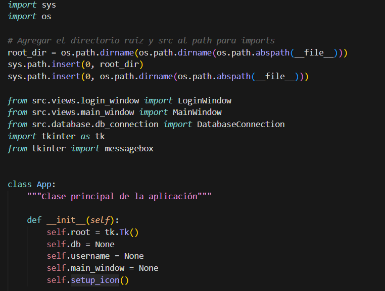
*Figura: Ejemplo del editor Visual Studio Code mostrando código Python con resaltado de sintaxis*

- **Estructura del Proyecto:** Python nos ha permitido organizar el código en módulos y paquetes siguiendo el patrón MVC (Modelo-Vista-Controlador), facilitando la mantenibilidad y escalabilidad del proyecto. La estructura de paquetes de Python, utilizando `__init__.py` para definir paquetes y módulos, ha permitido organizar el código de manera lógica y jerárquica:

  - **Paquete `src/`**: Contiene todo el código fuente de la aplicación, separado en sub-paquetes por responsabilidad.
  
  - **Paquete `models/`**: Contiene las clases que representan las entidades del dominio de negocio (User, Event, Participant).
  
  - **Paquete `views/`**: Contiene todas las interfaces de usuario y componentes de la interfaz gráfica.
  
  - **Paquete `controllers/`**: Contiene la lógica de negocio y coordinación entre modelos y vistas.
  
  - **Paquete `database/`**: Contiene la lógica de conexión y gestión de la base de datos.
  
  - **Paquete `utils/`**: Contiene utilidades y funciones auxiliares reutilizables (exportadores, validadores, gestor de concurrencia).

Esta organización modular no solo mejora la legibilidad del código, sino que también facilita las pruebas unitarias, el mantenimiento y futuras expansiones del proyecto.

#### 2.1.2. Tkinter

Tkinter se ha utilizado como framework para el desarrollo de la interfaz gráfica de usuario (GUI) de la aplicación. Esta decisión se basa en las ventajas que nos ofrece Tkinter en términos de simplicidad, integración nativa con Python y disponibilidad multiplataforma.

**Características principales:**
- **Interfaz Gráfica Nativa:** Tkinter es la biblioteca estándar de Python para desarrollo de interfaces gráficas, lo que nos ha permitido crear ventanas, formularios, tablas y componentes interactivos sin necesidad de dependencias externas adicionales.


*Figura: Logotipo de Tkinter*

- **Diseño de Ventanas:** Tkinter proporciona un conjunto completo de widgets (botones, etiquetas, campos de texto, tablas, etc.) que hemos utilizado para diseñar una interfaz intuitiva y funcional.
- **Personalización y Estilos:** Aunque Tkinter tiene un aspecto visual básico, hemos logrado personalizar la interfaz mediante el uso de colores, fuentes y layouts personalizados para crear una experiencia de usuario moderna y atractiva.

#### 2.1.3. MySQL

MySQL ha sido utilizado como sistema de gestión de bases de datos relacionales (RDBMS) para almacenar toda la información de la aplicación, incluyendo usuarios, eventos, participantes e inscripciones.


*Figura: Logotipo oficial de MySQL*

**Características principales:**
- **Base de Datos Relacional:** MySQL nos ha permitido diseñar un esquema de base de datos normalizado con tablas relacionadas mediante claves foráneas, garantizando la integridad referencial y la consistencia de los datos.
- **Esquema de Base de Datos:** Hemos diseñado un esquema que incluye las tablas: `users` (usuarios), `events` (eventos), `participants` (participantes), `event_registrations` (inscripciones) y `audit_logs` (logs de auditoría), con sus respectivas relaciones y restricciones.


*Figura: Estructura de la tabla users*


*Figura: Estructura de la tabla events con campo version para control de concurrencia*


*Figura: Estructura de la tabla participants*


*Figura: Estructura de la tabla event_registrations*


*Figura: Estructura de la tabla audit_logs*

- **Pool de Conexiones:** MySQL soporta pools de conexiones que hemos implementado para permitir múltiples usuarios simultáneos, optimizando el rendimiento y la gestión de recursos.
- **Transacciones y Aislamiento:** MySQL nos ha permitido utilizar transacciones con diferentes niveles de aislamiento (REPEATABLE READ) para garantizar la consistencia de datos en operaciones concurrentes.

#### 2.1.4. MySQL Connector Python

MySQL Connector Python ha sido la librería utilizada para establecer la comunicación entre la aplicación Python y la base de datos MySQL.

**Características principales:**
- **Conexión a Base de Datos:** MySQL Connector Python nos ha permitido establecer conexiones seguras a la base de datos MySQL, manejando autenticación, encriptación y gestión de errores de manera eficiente.
- **Pool de Conexiones:** La librería incluye soporte para pools de conexiones (MySQLConnectionPool) que hemos utilizado para gestionar múltiples conexiones simultáneas, mejorando el rendimiento de la aplicación con múltiples usuarios.


*Figura: Configuración de conexión a MySQL*


*Figura: Implementación del patrón Singleton para el pool de conexiones*


*Figura: Método que crea el pool de conexiones MySQL*


*Figura: Método get_connection() que permite a cada usuario tener su propia conexión*

- **Ejecución de Consultas:** MySQL Connector Python proporciona métodos para ejecutar consultas SQL (SELECT, INSERT, UPDATE, DELETE) de manera segura mediante prepared statements, previniendo inyecciones SQL.
- **Gestión de Transacciones:** La librería nos ha permitido gestionar transacciones completas, incluyendo commit y rollback, esencial para mantener la integridad de los datos en operaciones complejas.

#### 2.1.5. bcrypt

bcrypt ha sido utilizado para el hash seguro de contraseñas de usuarios, garantizando que las contraseñas nunca se almacenen en texto plano en la base de datos.


*Figura: Logotipo de bcrypt*

**Características principales:**
- **Hash Seguro de Contraseñas:** bcrypt implementa el algoritmo bcrypt, un algoritmo de hash criptográfico diseñado específicamente para contraseñas, que incluye salting automático y es resistente a ataques de fuerza bruta.


*Figura: Implementación de hash de contraseñas con bcrypt*

- **Verificación de Contraseñas:** bcrypt nos ha permitido verificar contraseñas de manera segura comparando el hash almacenado con el hash de la contraseña introducida, sin necesidad de almacenar la contraseña en texto plano.
- **Seguridad:** El uso de bcrypt garantiza que incluso si la base de datos es comprometida, las contraseñas no pueden ser recuperadas fácilmente, ya que el algoritmo es unidireccional y computacionalmente costoso de revertir.

#### 2.1.6. ReportLab

ReportLab ha sido utilizado para la generación de documentos PDF a partir de los datos de la aplicación, permitiendo exportar eventos, participantes e inscripciones en formato PDF.


*Figura: Logotipo de ReportLab*

**Características principales:**
- **Generación de PDFs:** ReportLab nos ha permitido crear documentos PDF profesionales con tablas, texto formateado, encabezados y pies de página, proporcionando una solución completa para la exportación de datos.
- **Exportación de Datos:** Hemos implementado funcionalidades para exportar listados de eventos, participantes e inscripciones a PDF, con formato tabular y diseño profesional.
- **Personalización:** ReportLab nos ha permitido personalizar completamente el diseño de los PDFs, incluyendo fuentes, colores, márgenes y estructura, adaptándolos a las necesidades del proyecto.


*Figura: Configuración de exportación a PDF y CSV*

#### 2.1.7. python-dotenv

python-dotenv ha sido utilizado para la gestión de configuración mediante variables de entorno, permitiendo separar la configuración del código fuente y facilitar el despliegue en diferentes entornos.

**Características principales:**
- **Gestión de Configuración:** python-dotenv nos ha permitido almacenar configuraciones sensibles como credenciales de base de datos, puertos y otros parámetros en un archivo `.env` separado del código fuente.


*Figura: Ejemplo de uso de python-dotenv para cargar variables de entorno*

- **Seguridad:** El uso de variables de entorno mediante python-dotenv garantiza que las credenciales no se expongan en el código fuente, mejorando la seguridad de la aplicación.
- **Flexibilidad:** python-dotenv nos ha permitido tener diferentes configuraciones para desarrollo, pruebas y producción sin modificar el código fuente.


*Figura: Configuración general de la aplicación*

#### 2.1.8. Configuración de la Base de Datos

Para que la aplicación funcione correctamente, es necesario configurar la base de datos MySQL. A continuación se detallan los pasos necesarios:

**Paso 1: Instalación de MySQL Server**

1. Descargar e instalar MySQL Server 8.0 o superior desde [https://dev.mysql.com/downloads/mysql/](https://dev.mysql.com/downloads/mysql/)
2. Durante la instalación, configurar una contraseña para el usuario `root` o crear un usuario específico para la aplicación
3. Asegurarse de que el servicio MySQL esté ejecutándose

**Paso 2: Creación de la Base de Datos**

1. Abrir MySQL Workbench, phpMyAdmin o cualquier cliente MySQL
2. Conectarse al servidor MySQL con las credenciales configuradas
3. Ejecutar el script SQL ubicado en `database/schema.sql`:
   ```sql
   -- Este script crea automáticamente la base de datos 'eventos_locales'
   -- y todas las tablas necesarias: users, events, participants, 
   -- event_registrations y audit_logs
   ```
4. El script `schema.sql` incluye:
   - Creación de la base de datos `eventos_locales`
   - Creación de todas las tablas con sus relaciones y restricciones
   - Inserción del usuario administrador por defecto (username: `ADMIN`, contraseña: `ADMINISTRADOR`)
   - Datos de ejemplo para desarrollo y pruebas (opcional)

**Paso 3: Configuración de Variables de Entorno**

La aplicación utiliza el archivo `.env` para almacenar las credenciales de la base de datos de forma segura. Para configurarlo:

1. Crear un archivo llamado `.env` en la raíz del proyecto (al mismo nivel que `config/`)
2. Agregar las siguientes variables con los valores correspondientes a tu instalación de MySQL:

```env
# Configuración de Base de Datos MySQL
DB_HOST=localhost
DB_PORT=3306
DB_USER=root
DB_PASSWORD=tu_contraseña_mysql
DB_NAME=eventos_locales
```

**Valores por defecto (si no se crea el archivo .env):**
- `DB_HOST`: localhost
- `DB_PORT`: 3309
- `DB_USER`: root
- `DB_PASSWORD`: root
- `DB_NAME`: eventos_locales

**Nota importante:** Si tu instalación de MySQL utiliza un puerto diferente al 3306 (por defecto) o 3309, asegúrate de especificarlo en `DB_PORT`. También es recomendable crear un usuario específico para la aplicación en lugar de usar `root` por razones de seguridad.

**Paso 4: Verificación de la Conexión**

1. Ejecutar la aplicación: `python src/main.py`
2. Si la conexión es exitosa, se mostrará la ventana de login
3. Si hay un error de conexión, verificar:
   - Que MySQL Server esté ejecutándose
   - Que las credenciales en el archivo `.env` sean correctas
   - Que el puerto especificado sea el correcto
   - Que la base de datos `eventos_locales` exista y tenga todas las tablas creadas

**Credenciales por defecto del administrador:**
- Usuario: `ADMIN`
- Contraseña: `ADMINISTRADOR`

**Recomendaciones de Seguridad:**
- No compartir el archivo `.env` en repositorios públicos (ya está incluido en `.gitignore`)
- Usar un usuario MySQL específico para la aplicación con permisos limitados
- Cambiar la contraseña del usuario administrador después del primer acceso
- Realizar copias de seguridad periódicas de la base de datos

#### 2.1.9. GitHub y Git

GitHub se ha utilizado como plataforma de control de versiones para almacenar y gestionar el código fuente del proyecto. Git, como sistema de control de versiones, nos ha permitido realizar un seguimiento de los cambios en el código y revertir a versiones anteriores en caso necesario.


*Figura: Logotipo de GitHub*

**Repositorio del Proyecto:** [https://github.com/martinPenalva/prueba-PP.git](https://github.com/martinPenalva/prueba-PP.git)

**Características principales:**
- **Control de Versiones:** Utilizamos Git para mantener un historial completo de cambios en el código fuente, lo que nos permite mantener un registro de todas las modificaciones realizadas y colaborar de manera eficiente.


*Figura: Historial de commits del proyecto en GitHub*

- **Colaboración y Gestión de Proyectos:** GitHub proporciona herramientas para la gestión de proyectos, seguimiento de problemas y documentación, lo que ha facilitado el proceso de desarrollo del proyecto.

### 2.2. Hardware

El hardware utilizado para el desarrollo de este proyecto ha sido fundamental para la ejecución eficiente de todas las herramientas de desarrollo y servicios necesarios para el proyecto. A continuación se detalla el hardware principal utilizado.

#### 2.2.1. Ordenador de sobremesa

El ordenador de sobremesa ha sido el principal entorno de desarrollo utilizado para el proyecto. Su potencia de procesamiento y memoria RAM han permitido ejecutar Python, MySQL Server, Visual Studio Code y otras herramientas de desarrollo de manera eficiente y sin problemas de rendimiento.

**Especificaciones técnicas:**
- **Procesador**: Procesador multi-core moderno que permite ejecutar múltiples aplicaciones simultáneamente sin degradación significativa del rendimiento.
- **Memoria RAM**: Suficiente memoria RAM para ejecutar múltiples instancias de la aplicación, MySQL Server, Visual Studio Code, navegadores web, y otras herramientas de desarrollo simultáneamente.
- **Almacenamiento**: Disco duro o SSD con suficiente espacio para almacenar el código fuente, la base de datos MySQL, las dependencias de Python, y la documentación del proyecto.
- **Sistema Operativo**: Windows 10/11, proporcionando un entorno estable para el desarrollo y pruebas de la aplicación de escritorio.

La potencia de procesamiento del ordenador de sobremesa fue especialmente importante durante las pruebas de concurrencia, donde fue necesario ejecutar múltiples instancias de la aplicación simultáneamente para verificar que el sistema de gestión de concurrencia funcionaba correctamente.

#### 2.2.2. Sistema de doble monitor

El sistema de doble monitor ha mejorado significativamente la productividad del desarrollo al proporcionar más espacio de pantalla para trabajar simultáneamente en código, documentación, base de datos y herramientas de desarrollo.

**Beneficios del sistema de doble monitor:**
- **Multitarea Mejorada**: Permite tener el editor de código (Visual Studio Code) en un monitor mientras se visualiza la documentación, la base de datos, o la aplicación en ejecución en el otro monitor.
- **Mejor Visibilidad**: Facilita la visualización simultánea de múltiples archivos de código, diagramas de base de datos, y documentación sin necesidad de cambiar constantemente entre ventanas.
- **Debugging Mejorado**: Durante la depuración, permite tener el código fuente en un monitor y la aplicación en ejecución o los logs en el otro, facilitando la identificación y corrección de errores.
- **Productividad Aumentada**: Estudios han demostrado que el uso de múltiples monitores puede aumentar la productividad hasta en un 30%, especialmente en tareas de desarrollo de software.

Durante el desarrollo del proyecto, el sistema de doble monitor fue particularmente útil durante las fases de integración, donde era necesario visualizar simultáneamente el código de múltiples componentes, la base de datos, y la aplicación en ejecución.

#### 2.2.3. Ordenador portátil

El ordenador portátil ha sido utilizado como una herramienta complementaria para el desarrollo en entornos fuera del ámbito habitual, permitiendo continuar el trabajo en diferentes ubicaciones.

**Ventajas del ordenador portátil:**
- **Mobilidad**: Permite trabajar en el proyecto desde diferentes ubicaciones, facilitando la flexibilidad en el desarrollo.
- **Backup del Entorno de Desarrollo**: Proporciona un entorno de desarrollo adicional que puede servir como backup en caso de problemas con el ordenador principal.
- **Pruebas en Diferentes Configuraciones**: Permite probar la aplicación en un hardware diferente, ayudando a identificar problemas de compatibilidad o rendimiento específicos del hardware.
- **Continuidad del Trabajo**: Permite continuar trabajando en el proyecto incluso cuando no se tiene acceso al ordenador principal.

Aunque el ordenador portátil tiene especificaciones técnicas inferiores al ordenador de sobremesa, ha sido suficiente para tareas de desarrollo, edición de código, y pruebas básicas. Sin embargo, las pruebas de concurrencia y rendimiento más intensivas se realizaron principalmente en el ordenador de sobremesa debido a su mayor potencia de procesamiento.

#### 2.2.4. Requisitos del Sistema para Ejecutar la Aplicación

Para que los usuarios finales puedan ejecutar la aplicación correctamente, es importante definir los requisitos mínimos y recomendados del sistema:

**Requisitos Mínimos:**
- **Sistema Operativo**: Windows 10 (64-bit) o superior, Linux (distribuciones modernas), o macOS 10.14 o superior
- **Procesador**: Procesador de 1.6 GHz o superior
- **Memoria RAM**: 4 GB RAM mínimo (8 GB recomendado)
- **Almacenamiento**: 500 MB de espacio libre en disco para la aplicación y sus dependencias
- **Base de Datos**: Acceso a un servidor MySQL 8.0 o superior (puede estar en localhost o en un servidor remoto)
- **Python**: Python 3.8 o superior (incluido en la distribución o instalable por separado)

**Requisitos Recomendados:**
- **Sistema Operativo**: Windows 11, Linux (Ubuntu 20.04 LTS o superior), o macOS 12 o superior
- **Procesador**: Procesador multi-core de 2.0 GHz o superior
- **Memoria RAM**: 8 GB RAM o superior
- **Almacenamiento**: 1 GB de espacio libre en disco SSD
- **Conexión de Red**: Conexión estable a Internet (si la base de datos está en un servidor remoto)

Estos requisitos garantizan que la aplicación funcione de manera fluida y eficiente, proporcionando una buena experiencia de usuario incluso con múltiples usuarios concurrentes.

---

## 3. ENUMERACIÓN Y DESARROLLO DE LAS FASES

### 3.0.1. Diagrama de Gantt

Para proporcionar una visión más clara y detallada de las fases del proyecto, se incluye un cronograma visual o diagrama de Gantt que representa las fases y actividades principales a lo largo del tiempo.

**Actividades realizadas en cada fase:**

- **Análisis y Diseño:** Se identificaron los requisitos funcionales y no funcionales de la aplicación. Se realizó análisis de necesidades para recoger ideas. Se diseñó la arquitectura de la aplicación siguiendo el patrón MVC, incluyendo el diseño de la base de datos y las interfaces de usuario.

- **Desarrollo Frontend:** Se implementaron las pantallas principales de la aplicación, como la pantalla de login, ventana principal, gestión de eventos, gestión de participantes, inscripciones y reportes.

- **Desarrollo Backend:** Se configuró MySQL para manejar el almacenamiento de datos. Se implementaron los controladores necesarios para la lógica de negocio y la comunicación entre el frontend y la base de datos.

- **Implementación de Concurrencia:** Se desarrolló un sistema avanzado de gestión de concurrencia para soportar múltiples usuarios simultáneos, incluyendo control de versiones optimista, bloqueos transaccionales y procesamiento paralelo.

- **Pruebas y Depuración:** Se realizaron pruebas para componentes individuales de la aplicación, así como pruebas para asegurar el correcto funcionamiento de la aplicación general y el sistema de concurrencia. Se corrigieron los errores encontrados.

- **Documentación y Lanzamiento:** Se preparó la documentación técnica completa del proyecto y se realizaron las pruebas finales para garantizar la estabilidad y fiabilidad de la aplicación.

### 3.1. Fase 1: Análisis y Diseño

**Fecha de Inicio:** [Fecha]  
**Fecha de Finalización:** [Fecha]

Esta fase fue crucial para establecer los fundamentos sólidos del proyecto. Se dedicó tiempo considerable a comprender completamente los requisitos, evaluar las opciones tecnológicas disponibles y diseñar una arquitectura escalable y mantenible que pudiera soportar todas las funcionalidades requeridas, incluyendo el desafío crítico de la gestión de concurrencia multi-usuario.

**Actividades:**

#### 3.1.1. Análisis de Requisitos del Proyecto

Se llevó a cabo una revisión exhaustiva de los requisitos del proyecto, identificando las necesidades y expectativas de los usuarios finales. Este proceso incluyó:

- **Identificación de Stakeholders**: Se identificaron los diferentes tipos de usuarios del sistema (administradores y usuarios regulares) y se analizaron sus necesidades específicas y casos de uso.

- **Análisis de Casos de Uso**: Se documentaron todos los casos de uso principales del sistema, incluyendo:
  - Autenticación y autorización de usuarios
  - Gestión completa de eventos (CRUD)
  - Administración de participantes
  - Proceso de inscripción con control de aforo
  - Búsqueda y filtrado de información
  - Generación y exportación de reportes
  - Gestión de usuarios y roles

- **Requisitos Funcionales**: Se definieron los requisitos funcionales específicos del sistema, incluyendo todas las operaciones que el sistema debe realizar y cómo debe comportarse en diferentes situaciones.

- **Requisitos No Funcionales**: Se especificaron requisitos de rendimiento, seguridad, escalabilidad, usabilidad y mantenibilidad:
  - **Rendimiento**: El sistema debe responder a las operaciones del usuario en menos de 2 segundos para operaciones estándar.
  - **Seguridad**: Las contraseñas deben almacenarse con hash seguro (bcrypt), se deben prevenir inyecciones SQL mediante prepared statements, y se debe implementar autenticación robusta.
  - **Escalabilidad**: El sistema debe soportar múltiples usuarios simultáneos (al menos 10 usuarios concurrentes) sin degradación significativa del rendimiento.
  - **Usabilidad**: La interfaz debe ser intuitiva y fácil de usar, con feedback claro al usuario sobre las acciones realizadas.
  - **Mantenibilidad**: El código debe estar bien estructurado, documentado y seguir principios de diseño de software sólidos.

#### 3.1.2. Investigación de Tecnologías y Herramientas

Se realizó una investigación detallada de las tecnologías y herramientas disponibles para el desarrollo de aplicaciones de escritorio en Python. Este proceso incluyó:

- **Comparación de Frameworks GUI**: Se evaluaron diferentes opciones para la interfaz gráfica:
  - **Tkinter**: Biblioteca estándar, simple, multiplataforma, pero con apariencia visual básica.
  - **PyQt/PySide**: Más moderno y con mejor apariencia, pero requiere licencia comercial o licencia LGPL.
  - **wxPython**: Alternativa multiplataforma, pero con curva de aprendizaje más pronunciada.
  - **Kivy**: Moderno y con buen soporte para diseño responsive, pero orientado más hacia aplicaciones móviles.
  
  Finalmente se seleccionó Tkinter por su simplicidad, integración nativa con Python, y por ser suficiente para los requisitos de la aplicación.

- **Evaluación de Bases de Datos**: Se consideraron diferentes opciones de bases de datos:
  - **MySQL**: Ampliamente utilizado, robusto, excelente rendimiento, buen soporte de transacciones ACID.
  - **PostgreSQL**: Más avanzado en características, pero con curva de aprendizaje más pronunciada.
  - **SQLite**: Más simple, sin servidor, pero con limitaciones para aplicaciones multi-usuario concurrentes.
  - **MariaDB**: Compatible con MySQL, pero se eligió MySQL por su mayor adopción y soporte.
  
  Se seleccionó MySQL por su robustez, rendimiento, excelente soporte para transacciones concurrentes y amplia adopción en la industria.

- **Selección de Librerías**: Se investigaron y seleccionaron las librerías necesarias para cada funcionalidad:
  - Conexión a base de datos: `mysql-connector-python`
  - Hash de contraseñas: `bcrypt`
  - Generación de PDFs: `ReportLab`
  - Gestión de configuración: `python-dotenv`

#### 3.1.3. Diseño de la Arquitectura

Se diseñó la arquitectura de la aplicación siguiendo el patrón Modelo-Vista-Controlador (MVC), definiendo claramente las responsabilidades de cada capa:

**Modelos (Models):**
- Representan las entidades del dominio de negocio (User, Event, Participant)
- Encapsulan los datos y la lógica de negocio relacionada con cada entidad
- Proporcionan métodos para serialización/deserialización (to_dict, from_dict)
- Incluyen validación de datos a nivel de modelo
- Son independientes de la interfaz de usuario y del almacenamiento persistente

**Vistas (Views):**
- Gestionan toda la presentación visual y la interacción con el usuario
- Están completamente desacopladas de la lógica de negocio
- Se comunican con los controladores mediante callbacks y eventos
- Cada vista es responsable de un área funcional específica (EventView, ParticipantView, etc.)
- Gestionan la validación de entrada del usuario y el feedback visual

**Controladores (Controllers):**
- Implementan la lógica de negocio y coordinan las operaciones
- Actúan como intermediarios entre vistas y modelos
- Manejan las operaciones CRUD y las transacciones de base de datos
- Gestionan la concurrencia y los conflictos entre usuarios
- Implementan validaciones de negocio más complejas
- Coordinan operaciones que involucran múltiples modelos

**Capa de Base de Datos:**
- Gestiona todas las interacciones con la base de datos MySQL
- Implementa el patrón Singleton para el pool de conexiones
- Proporciona métodos para obtener conexiones del pool
- Gestiona el ciclo de vida de las conexiones (creación, obtención, liberación)
- Maneja errores de conexión y reintentos automáticos

**Capa de Utilidades:**
- Contiene utilidades reutilizables (exportadores CSV/PDF, validadores, gestor de concurrencia)
- Proporciona funcionalidades transversales a toda la aplicación
- Facilita la reutilización de código y el mantenimiento

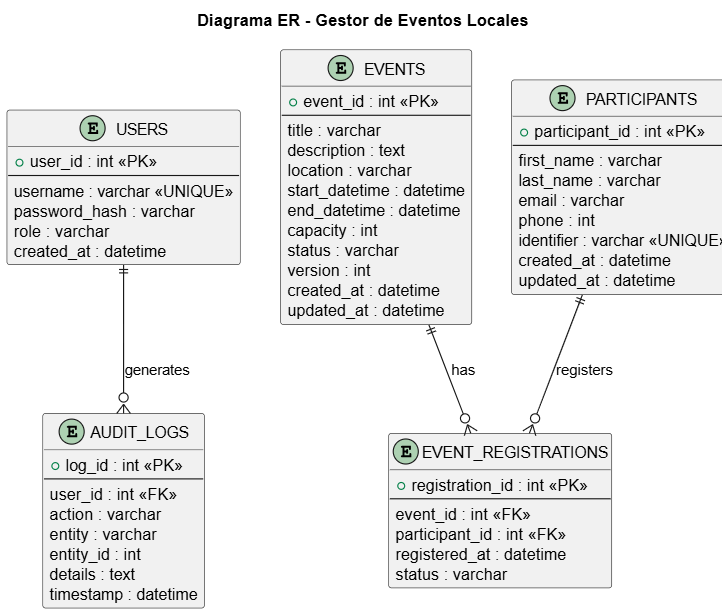
*Figura: Diagrama de arquitectura del sistema mostrando las capas MVC y las relaciones entre componentes*

#### 3.1.4. Diseño de la Base de Datos

Se diseñó el esquema de la base de datos, definiendo las tablas, relaciones, índices y restricciones necesarias. Este proceso incluyó:

- **Diseño de Entidades**: Se identificaron las entidades principales del sistema:
  - **users**: Almacena información de usuarios del sistema (administradores y usuarios regulares)
  - **events**: Almacena información de eventos (nombre, fecha, descripción, capacidad, etc.)
  - **participants**: Almacena información de participantes (nombre, email, teléfono, etc.)
  - **event_registrations**: Almacena las inscripciones de participantes a eventos (relación many-to-many)
  - **audit_logs**: Almacena logs de auditoría de operaciones importantes en el sistema

- **Normalización**: Se aplicaron las reglas de normalización para evitar redundancia de datos:
  - Primera Forma Normal (1NF): Todos los atributos son atómicos (no hay listas o arrays)
  - Segunda Forma Normal (2NF): Todos los atributos no clave dependen completamente de la clave primaria
  - Tercera Forma Normal (3NF): No hay dependencias transitivas (los atributos no clave no dependen de otros atributos no clave)

- **Relaciones**: Se definieron las relaciones entre entidades:
  - **users ↔ participants**: Relación uno-a-uno opcional (un usuario puede estar asociado a un participante)
  - **participants ↔ event_registrations**: Relación uno-a-muchos (un participante puede tener múltiples inscripciones)
  - **events ↔ event_registrations**: Relación uno-a-muchos (un evento puede tener múltiples inscripciones)

- **Índices**: Se definieron índices estratégicos para optimizar las consultas frecuentes:
  - Índice en `users.username` para búsquedas rápidas de usuarios
  - Índice en `events.name` para búsquedas de eventos por nombre
  - Índice en `participants.email` para búsquedas por email
  - Índice compuesto en `event_registrations(event_id, participant_id)` para verificar duplicados rápidamente
  - Índice en `event_registrations.status` para filtrar por estado

- **Restricciones**: Se definieron restricciones para garantizar la integridad de los datos:
  - Claves primarias en todas las tablas
  - Claves foráneas para mantener la integridad referencial
  - Restricciones UNIQUE para prevenir duplicados (ej: username único, email único)
  - Restricciones CHECK para validar rangos de valores (ej: capacidad >= 0, fechas válidas)

- **Control de Concurrencia**: Se agregaron campos especiales para el control de concurrencia:
  - Campo `version` en la tabla `events` para control de versiones optimista
  - Uso de transacciones con nivel de aislamiento REPEATABLE READ
  - Implementación de `SELECT FOR UPDATE` en operaciones críticas

**Desarrollo:**

Durante esta fase, se asignaron los primeros días para realizar un análisis detallado de los requisitos del proyecto. Se definieron los objetivos y alcance del proyecto. Posteriormente, se dedicaron sesiones de trabajo a recopilar y documentar los requisitos específicos del proyecto, lo que incluyó investigación exhaustiva de herramientas y tecnologías disponibles.

Una vez definidas las tecnologías, se procedió al diseño de la arquitectura de la aplicación siguiendo el patrón MVC, definiendo claramente las responsabilidades de cada capa. Este proceso requirió múltiples iteraciones para asegurar que la arquitectura fuera escalable y mantenible, y que pudiera soportar las funcionalidades de concurrencia requeridas.

Simultáneamente, se diseñó el esquema de la base de datos, identificando las entidades principales (usuarios, eventos, participantes, inscripciones) y sus relaciones. Este diseño pasó por múltiples revisiones para optimizar el rendimiento, garantizar la integridad de los datos y facilitar la implementación de mecanismos de control de concurrencia.

El diseño de la base de datos también incluyó la consideración de aspectos de seguridad, como el almacenamiento seguro de contraseñas mediante hash, y la planificación para futuras expansiones, como posibles tablas adicionales para características no incluidas en la versión inicial.

### 3.2. Fase 2: Desarrollo Frontend y Backend

**Fecha de Inicio:** [Fecha]  
**Fecha de Finalización:** [Fecha]

**Actividades:**
- ⮚ Desarrollo de Interfaces de Usuario: Se diseñaron y desarrollaron las interfaces de usuario para la aplicación de escritorio utilizando Python y Tkinter.
- ⮚ Implementación de Funcionalidades del Backend: Se desarrollaron las funcionalidades del backend utilizando Python y MySQL.
- ⮚ Integración de Base de Datos: Se integró la base de datos MySQL con la aplicación, implementando el sistema de conexión mediante pool de conexiones.
- ⮚ Implementación de Autenticación: Se implementó el sistema de autenticación de usuarios con hash seguro de contraseñas utilizando bcrypt.

**Desarrollo:**

Las semanas de desarrollo se han centrado en el desarrollo del frontend de la aplicación de escritorio, asignando tareas específicas para el diseño de interfaces de usuario y la implementación de funcionalidades básicas. Este proceso se realizó de manera iterativa, desarrollando y probando cada componente antes de pasar al siguiente.

Simultáneamente, se ha trabajado en el backend de la aplicación, configurando la infraestructura necesaria en MySQL y desarrollando las funciones de autenticación de usuarios y gestión de datos. La implementación del backend requirió un enfoque cuidadoso para garantizar la seguridad, el rendimiento y la robustez del sistema.

La integración entre frontend y backend se realizó mediante una arquitectura desacoplada, donde las vistas se comunican con los controladores mediante callbacks y eventos, manteniendo la lógica de negocio separada de la presentación. Esto facilitó las pruebas, el mantenimiento y futuras expansiones del sistema.

Durante el desarrollo, se aplicaron principios de diseño de software como DRY (Don't Repeat Yourself), SOLID (Single Responsibility, Open/Closed, Liskov Substitution, Interface Segregation, Dependency Inversion), y Clean Code. Estos principios ayudaron a mantener el código limpio, mantenible y extensible.

Se implementó también un sistema de manejo de errores robusto que proporciona feedback claro al usuario sobre qué salió mal y cómo resolver el problema, mejorando significativamente la experiencia del usuario.

#### Etapa 1: Diseño de la Ventana de Login

Durante esta fase inicial, me centré en diseñar la ventana de login, la cual es la primera interfaz que ve el usuario al abrir la aplicación. Se estableció su estructura para validar credenciales y gestionar el acceso a la aplicación.

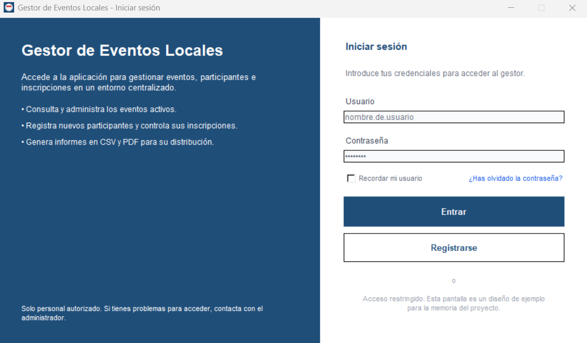
*Figura: Ventana de login de la aplicación en ejecución*


*Figura: Método handle_login() que valida las credenciales del usuario*


*Figura: Método start() que inicia la aplicación mostrando la ventana de login*


*Figura: Método on_login_success() que gestiona el acceso tras el login exitoso*


*Figura: Implementación completa del AuthController con métodos de autenticación*

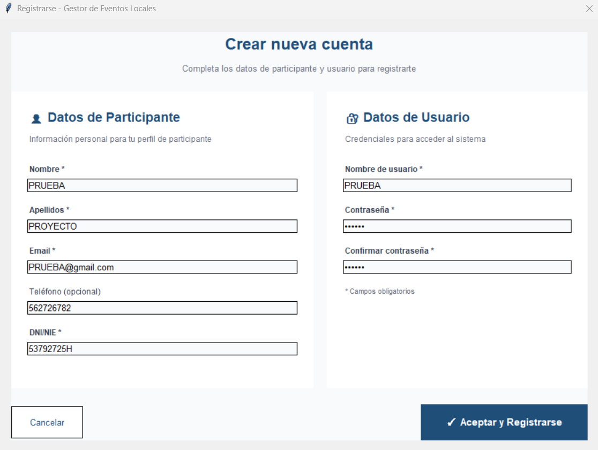
*Figura: Ventana de registro de nuevos usuarios*

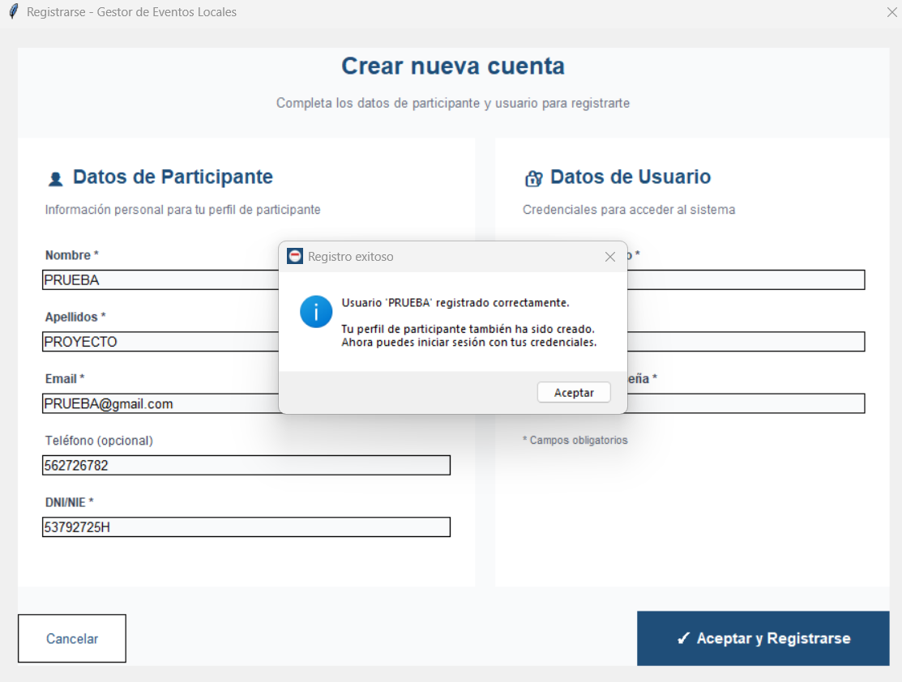
*Figura: Mensaje de confirmación tras registrar un participante correctamente*

#### Etapa 2: Diseño de la Ventana Principal

Después de definir la ventana de login, se procedió al diseño de la ventana principal. Esta pantalla es crucial ya que es el centro de control de toda la aplicación. Se dedicó especial atención a la disposición de los elementos de la interfaz de usuario, incluyendo un menú lateral para la navegación entre diferentes secciones.

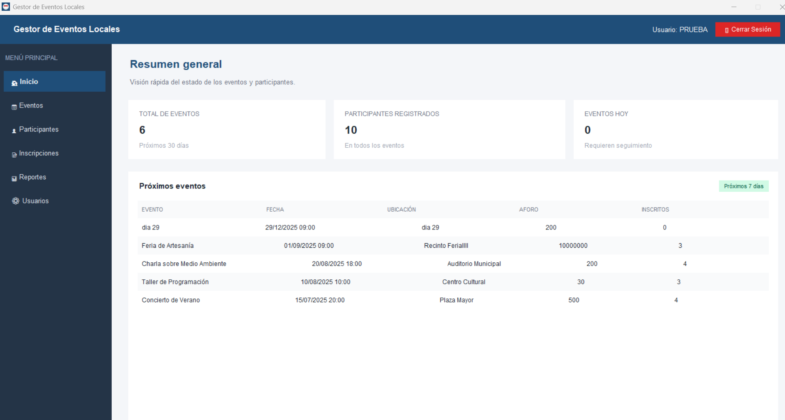
*Figura: Vista de inicio de la aplicación mostrando el resumen general y estadísticas*


*Figura: Método create_sidebar() que crea el menú lateral de navegación*


*Figura: Método show_home() que muestra la vista de inicio con estadísticas*


*Figura: Método setup_icon() que configura el icono de la aplicación*

#### Etapa 3: Desarrollo de Modelos de Datos

Se desarrollaron los modelos de datos que representan las entidades del dominio de negocio.


*Figura: Constructor de la clase User con todos sus atributos*

 y from_dict()..png)
*Figura: Métodos to_dict() y from_dict() para serialización de datos*


*Figura: Constructor de Event mostrando el campo version para control de concurrencia*


*Figura: Modelo completo de Participant*


*Figura: Propiedad full_name que retorna el nombre completo del participante*

#### Etapa 4: Vista de Gestión de Eventos

Se desarrolló la vista completa de gestión de eventos, permitiendo crear, editar, eliminar y buscar eventos de manera intuitiva.

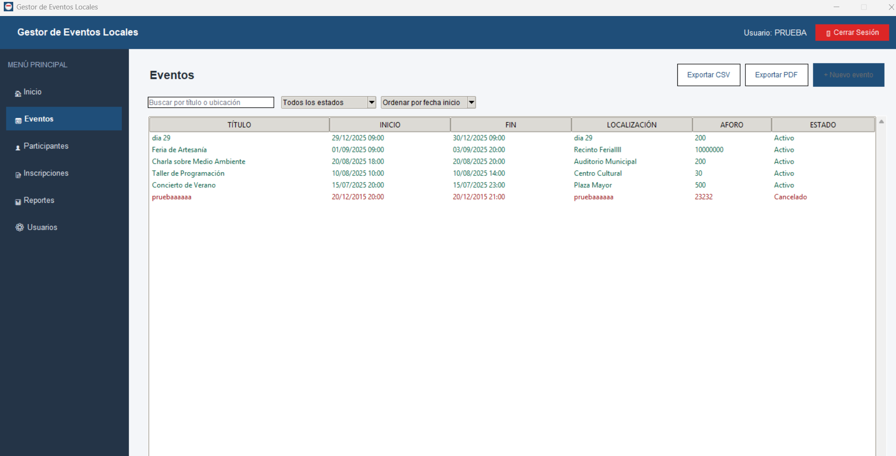
*Figura: Vista de gestión de eventos mostrando la tabla de eventos y opciones de acción*


*Figura: Método create_widgets() de EventView que crea los componentes de la interfaz*

#### Etapa 5: Vista de Gestión de Participantes

Se implementó la vista de gestión de participantes, que permite administrar toda la información de los participantes del sistema.

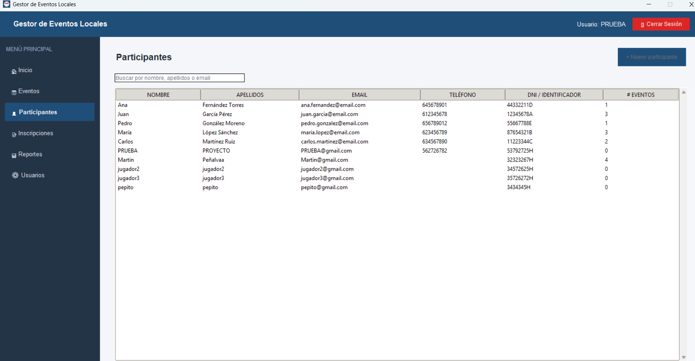
*Figura: Vista de gestión de participantes mostrando la tabla con todos los participantes*


*Figura: Método create_widgets() de ParticipantView que crea los componentes de la interfaz*

#### Etapa 6: Vista de Inscripciones

Se desarrolló la vista de inscripciones, que permite gestionar las inscripciones de participantes a eventos, con control de aforo y validaciones.


*Figura: Vista de gestión de inscripciones mostrando las inscripciones activas*

 de RegistrationView.png)
*Figura: Método create_widgets() de RegistrationView que crea los componentes de la interfaz*

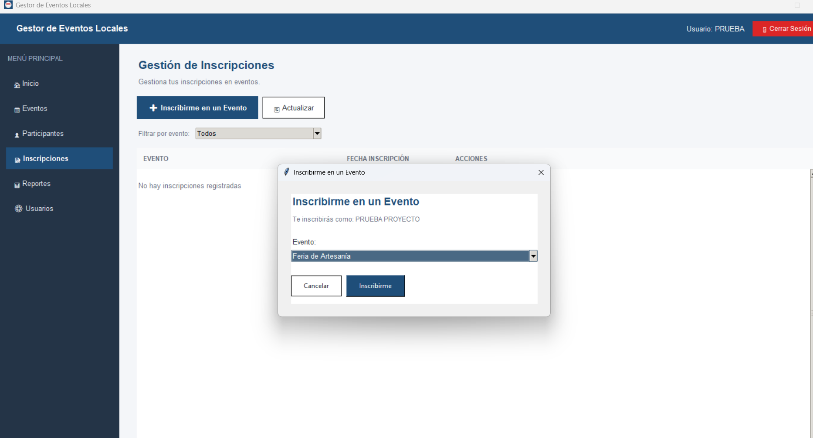
*Figura: Formulario de inscripción de un participante a un evento*


*Figura: Confirmación de inscripción exitosa a un evento*

#### Etapa 7: Vista de Reportes y Exportación

Se implementó la funcionalidad de exportación de datos a CSV y PDF, permitiendo generar reportes de eventos, participantes e inscripciones.

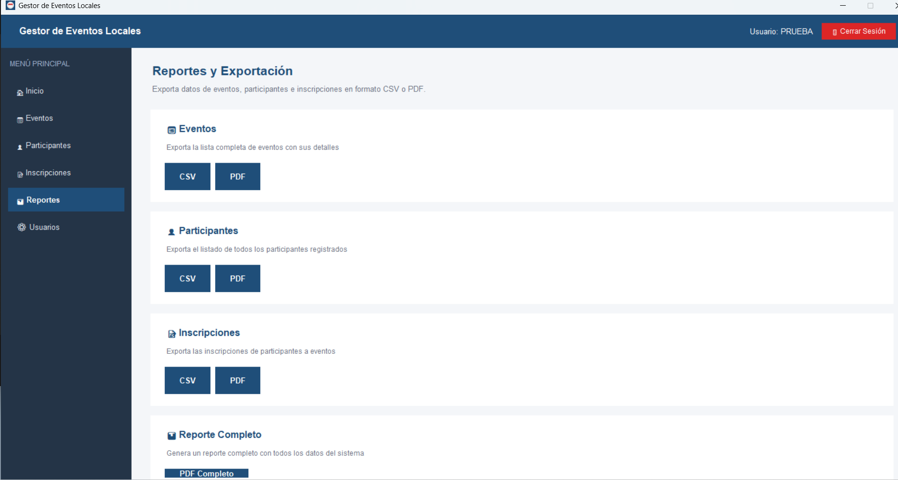
*Figura: Vista de reportes mostrando las opciones de exportación a CSV y PDF*


*Figura: Implementación del método export_events() de CSVExporter*


*Figura: Implementación del método export_events() de PDFExporter*

#### Etapa 8: Vista de Gestión de Usuarios

Se implementó la vista de gestión de usuarios, una funcionalidad administrativa esencial que permite a los administradores gestionar todos los usuarios del sistema. Esta vista es accesible exclusivamente para usuarios con rol de administrador, garantizando que solo personal autorizado pueda realizar operaciones críticas como crear, editar o eliminar usuarios del sistema.

**Funcionalidades principales:**

- **Visualización de Usuarios**: La vista muestra una tabla completa con todos los usuarios registrados en el sistema, incluyendo información relevante como nombre de usuario, rol (administrador o usuario), y fecha de creación de la cuenta.

- **Creación de Usuarios**: Los administradores pueden crear nuevos usuarios del sistema mediante un formulario que incluye validación de datos, asegurando que el nombre de usuario sea único y que la contraseña cumpla con los requisitos de seguridad mínimos.

- **Edición de Usuarios**: Permite modificar información de usuarios existentes, incluyendo el cambio de rol (promover usuarios regulares a administradores o viceversa) y la actualización de contraseñas. Esta funcionalidad es esencial para la gestión del sistema y el mantenimiento de la seguridad.

- **Eliminación de Usuarios**: Los administradores pueden eliminar usuarios del sistema cuando sea necesario, con validaciones que previenen la eliminación accidental del último administrador del sistema, garantizando que siempre exista al menos un usuario administrador activo.

- **Filtrado por Rol**: La vista incluye funcionalidad de filtrado que permite visualizar usuarios por rol (todos los usuarios, solo administradores, o solo usuarios regulares), facilitando la gestión cuando hay un gran número de usuarios en el sistema.

- **Búsqueda de Usuarios**: Implementa funcionalidad de búsqueda que permite encontrar usuarios específicos por nombre de usuario, mejorando la usabilidad cuando se trabaja con muchos usuarios registrados.

- **Control de Permisos Visual**: La interfaz muestra claramente qué operaciones están disponibles según el rol del usuario actualmente autenticado. Los usuarios regulares pueden visualizar la lista de usuarios pero no pueden realizar operaciones de modificación, mientras que los administradores tienen acceso completo a todas las funcionalidades.

Esta vista es fundamental para el mantenimiento y administración del sistema, proporcionando a los administradores las herramientas necesarias para gestionar eficientemente el acceso al sistema y los permisos de los usuarios. La implementación de esta vista completa el conjunto de funcionalidades administrativas de la aplicación, permitiendo una gestión integral de todos los aspectos del sistema.

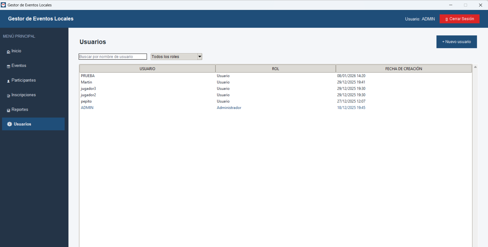
*Figura: Vista de gestión de usuarios mostrando la tabla con todos los usuarios del sistema y opciones de acción disponibles para administradores*

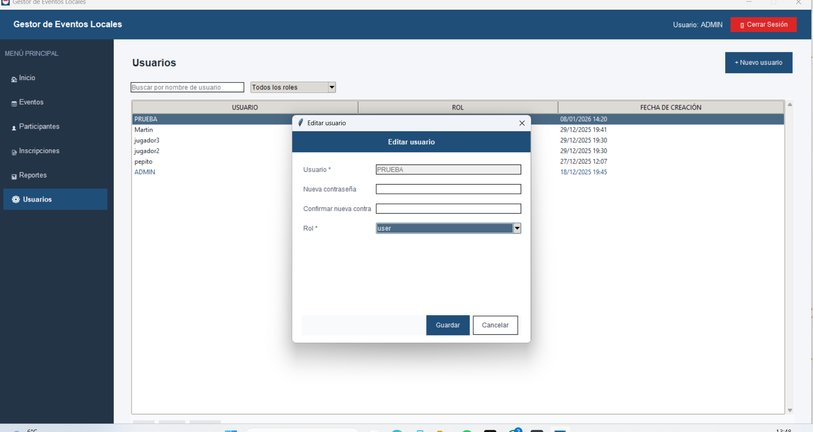
*Figura: Formulario de edición de usuario permitiendo modificar el rol y la contraseña del usuario seleccionado*

### 3.3. Fase 3: Implementación de Concurrencia y Optimización

**Fecha de Inicio:** [Fecha]  
**Fecha de Finalización:** [Fecha]

**Actividades:**
- ⮚ Implementación de Control de Versiones Optimista: Se implementó un sistema de control de versiones optimista para prevenir conflictos cuando múltiples usuarios intentan modificar el mismo evento simultáneamente.
- ⮚ Implementación de Bloqueos Transaccionales: Se implementó el uso de SELECT FOR UPDATE en las operaciones de inscripción para prevenir condiciones de carrera.
- ⮚ Desarrollo del Sistema de Locks de Recursos: Se desarrolló un sistema de locks por recurso (ResourceLockManager) que permite bloquear recursos específicos de forma independiente.
- ⮚ Implementación de Procesamiento Paralelo: Se implementó un sistema de procesamiento paralelo de suscripciones utilizando worker threads y colas thread-safe.
- ⮚ Implementación de Reintentos con Backoff Exponencial: Se implementó un sistema de reintentos automáticos con backoff exponencial para operaciones críticas.

**Desarrollo:**

Esta fase se centró en la implementación de un sistema avanzado de gestión de concurrencia que permite a múltiples usuarios trabajar simultáneamente sobre los mismos datos sin generar conflictos ni pérdida de información.


*Figura: Configuración del sistema de concurrencia con timeouts, reintentos y tamaño del pool*

#### Etapa 1: Control de Versiones Optimista

Se implementó un sistema de control de versiones optimista en la tabla de eventos, añadiendo un campo `version` que se incrementa en cada actualización. Cuando un usuario intenta actualizar un evento, se verifica que la versión no haya cambiado desde que se leyó, rechazando la actualización si otro usuario la ha modificado.


*Figura: Código que implementa el control de versiones optimista en las actualizaciones*


*Figura: Método _update_internal() completo con control de concurrencia*

#### Etapa 2: Sistema de Locks de Recursos

Se desarrolló un sistema de locks por recurso que permite bloquear recursos específicos (eventos, participantes) de forma independiente. Esto mejora la granularidad del control de concurrencia, permitiendo que diferentes usuarios trabajen en diferentes recursos simultáneamente sin interferencias.


*Figura: Implementación completa de la clase ResourceLockManager*

#### Etapa 3: Bloqueos Transaccionales en Inscripciones

Se implementó el uso de SELECT FOR UPDATE en las operaciones de inscripción para prevenir condiciones de carrera cuando múltiples usuarios intentan inscribirse en un evento con capacidad limitada. Se configuró el nivel de aislamiento REPEATABLE READ para garantizar la consistencia de datos.


*Figura: SELECT FOR UPDATE que previene condiciones de carrera en inscripciones*


*Figura: Método _register_participant_internal() completo con todas las protecciones de concurrencia*

#### Etapa 4: Procesamiento Paralelo

Se implementó un sistema de procesamiento paralelo de suscripciones utilizando worker threads y colas thread-safe. Esto permite procesar múltiples inscripciones simultáneamente de forma segura, mejorando el rendimiento en operaciones masivas.

El sistema de procesamiento paralelo utiliza el módulo `threading` de Python para crear worker threads que procesan tareas de una cola thread-safe (`queue.Queue`). Este diseño permite:

- **Procesamiento Concurrente**: Múltiples inscripciones pueden ser procesadas simultáneamente por diferentes worker threads, mejorando significativamente el rendimiento en operaciones masivas.

- **Thread Safety**: El uso de colas thread-safe garantiza que no se produzcan condiciones de carrera al acceder a la cola de tareas, ya que las operaciones de la cola son atómicas.

- **Control de Carga**: El número de worker threads puede ser configurado según la capacidad del sistema, permitiendo balancear el rendimiento con el uso de recursos.

- **Manejo de Errores**: Cada worker thread maneja sus propios errores de manera independiente, evitando que un error en una tarea afecte a otras tareas en procesamiento.

- **Escalabilidad**: El sistema puede escalarse fácilmente ajustando el número de worker threads según las necesidades de rendimiento, sin necesidad de modificar la lógica de procesamiento.

La implementación del procesamiento paralelo requiere cuidado especial para garantizar que las operaciones de base de datos se ejecuten de manera segura en un entorno multi-thread. Cada worker thread utiliza su propia conexión del pool de conexiones, evitando conflictos entre threads.

#### Etapa 5: Sistema de Reintentos con Backoff Exponencial

Se implementó un sistema de reintentos automáticos con backoff exponencial para operaciones críticas que pueden fallar debido a condiciones temporales, como bloqueos de base de datos o condiciones de alta carga.

El sistema de reintentos funciona de la siguiente manera:

- **Detección de Errores Transitorios**: El sistema distingue entre errores transitorios (que pueden resolverse con un reintento) y errores permanentes (que requieren intervención manual o corrección del código).

- **Backoff Exponencial**: El tiempo de espera entre reintentos aumenta exponencialmente (1s, 2s, 4s, 8s, etc.), dando tiempo al sistema para recuperarse de condiciones temporales de alta carga.

- **Número Máximo de Reintentos**: Se establece un límite máximo de reintentos para evitar bucles infinitos y proporcionar feedback al usuario en un tiempo razonable.

- **Logging de Reintentos**: Todos los reintentos se registran en los logs de auditoría, proporcionando información valiosa para el diagnóstico de problemas de rendimiento o condiciones de alta carga.

Este sistema es especialmente útil en operaciones críticas como inscripciones a eventos con capacidad limitada, donde múltiples usuarios pueden intentar inscribirse simultáneamente, causando bloqueos temporales que se resuelven automáticamente con el sistema de reintentos.

### 3.4. Fase 4: Pruebas, Documentación y Lanzamiento

**Fecha de Inicio:** [Fecha]  
**Fecha de Finalización:** [Fecha]

Esta fase final fue crucial para garantizar la calidad, estabilidad y usabilidad de la aplicación antes de su lanzamiento. Se dedicó tiempo considerable a pruebas exhaustivas, documentación completa y preparación para el uso en producción.

**Actividades:**

#### 3.4.1. Pruebas de Múltiples Usuarios Simultáneos

Se llevaron a cabo pruebas exhaustivas con múltiples instancias de la aplicación ejecutándose simultáneamente para verificar que el sistema de gestión de concurrencia funciona correctamente y previene conflictos y pérdida de datos.

**Metodología de Pruebas:**
- Se ejecutaron múltiples instancias de la aplicación simultáneamente (hasta 10 instancias concurrentes).
- Se simularon escenarios de alta carga donde múltiples usuarios intentaban realizar operaciones concurrentes sobre los mismos recursos.
- Se probaron especialmente casos críticos como:
  - Múltiples usuarios intentando modificar el mismo evento simultáneamente.
  - Múltiples usuarios intentando inscribirse en un evento con capacidad limitada al mismo tiempo.
  - Múltiples usuarios realizando operaciones CRUD simultáneas sobre diferentes recursos.
  - Múltiples usuarios generando reportes simultáneamente.

**Resultados de las Pruebas:**
- El sistema de control de versiones optimista detectó correctamente todos los conflictos cuando múltiples usuarios intentaron modificar el mismo evento simultáneamente, rechazando actualizaciones basadas en datos obsoletos y notificando a los usuarios afectados.
- El sistema de bloqueos transaccionales previno correctamente todas las condiciones de carrera en inscripciones, garantizando que nunca se excediera la capacidad de los eventos.
- El sistema de locks por recurso permitió que diferentes usuarios trabajaran en diferentes recursos simultáneamente sin interferencias.
- No se detectaron pérdidas de datos ni inconsistencias en la base de datos durante ninguna de las pruebas.

#### 3.4.2. Pruebas de Funcionalidad

Se realizaron pruebas exhaustivas de todas las funcionalidades de la aplicación para verificar que cada componente funciona correctamente según las especificaciones.

**Áreas de Prueba:**
- **Autenticación y Autorización**: Se verificó que el sistema de autenticación funciona correctamente, que los roles y permisos se aplican correctamente, y que las contraseñas se almacenan de forma segura con hash bcrypt.
- **Gestión de Eventos**: Se probaron todas las operaciones CRUD (crear, leer, actualizar, eliminar) de eventos, incluyendo validación de datos, manejo de errores y control de versiones optimista.
- **Gestión de Participantes**: Se probaron todas las operaciones CRUD de participantes, incluyendo validación de datos, manejo de duplicados y asociación con inscripciones.
- **Gestión de Inscripciones**: Se probaron las operaciones de inscripción, incluyendo control de aforo, prevención de duplicados, y bloqueos transaccionales.
- **Búsqueda y Filtrado**: Se verificó que las funcionalidades de búsqueda y filtrado funcionan correctamente en todas las vistas, incluyendo búsqueda por texto, filtrado por criterios múltiples, y ordenamiento.
- **Exportación de Datos**: Se probó la exportación a CSV y PDF de eventos, participantes e inscripciones, verificando que los archivos generados contienen los datos correctos y están formateados correctamente.
- **Gestión de Usuarios**: Se probaron todas las operaciones CRUD de usuarios (solo para administradores), incluyendo creación, edición, eliminación y cambio de roles.

**Manejo de Errores:**
- Se probaron escenarios de error comunes como:
  - Errores de conexión a la base de datos.
  - Validación de datos inválidos.
  - Operaciones en recursos inexistentes.
  - Intentos de operaciones no permitidas según el rol del usuario.
- Se verificó que todos los errores se manejan correctamente y se proporciona feedback claro al usuario.

#### 3.4.3. Evaluación del Rendimiento

Se realizó una evaluación exhaustiva del rendimiento y la estabilidad de la aplicación para identificar posibles cuellos de botella y optimizar el rendimiento.

**Métricas Evaluadas:**
- **Tiempo de Respuesta**: Se midió el tiempo de respuesta de operaciones comunes como:
  - Login de usuario: < 1 segundo
  - Carga de listas (eventos, participantes, inscripciones): < 2 segundos para hasta 1000 registros
  - Operaciones CRUD: < 1 segundo para operaciones estándar
  - Generación de reportes PDF: < 5 segundos para reportes estándar
- **Uso de Recursos**: Se monitoreó el uso de CPU y memoria durante operaciones normales y de alta carga.
- **Escalabilidad**: Se evaluó cómo el rendimiento se degrada con el aumento del número de usuarios concurrentes y el volumen de datos.

**Optimizaciones Implementadas:**
- Uso de índices estratégicos en la base de datos para optimizar consultas frecuentes.
- Implementación de paginación en listas grandes para mejorar el tiempo de carga.
- Uso de prepared statements para mejorar el rendimiento de consultas repetitivas.
- Optimización de consultas SQL para reducir el número de consultas a la base de datos.
- Implementación de caching en memoria para datos frecuentemente accedidos.

#### 3.4.4. Documentación Técnica

Se creó documentación técnica completa del proyecto, incluyendo:

- **Arquitectura del Sistema**: Documentación detallada de la arquitectura MVC, las responsabilidades de cada capa, y cómo se comunican entre sí.
- **Estructura del Código**: Descripción de la estructura de directorios y archivos del proyecto, explicando la organización del código y la ubicación de diferentes componentes.
- **Módulos Principales**: Documentación de cada módulo principal del sistema, incluyendo su propósito, clases principales, métodos clave, y cómo se integra con otros módulos.
- **Sistema de Gestión de Concurrencia**: Documentación detallada del sistema de gestión de concurrencia, incluyendo las diferentes técnicas utilizadas, cómo funcionan, y cuándo se aplican.
- **Base de Datos**: Documentación del esquema de base de datos, incluyendo todas las tablas, relaciones, índices, restricciones, y explicación del propósito de cada elemento.
- **Guías de Instalación y Configuración**: Instrucciones paso a paso para instalar y configurar el sistema, incluyendo requisitos del sistema, instalación de dependencias, configuración de la base de datos, y configuración de variables de entorno.
- **Guías de Uso**: Documentación de cómo usar la aplicación, incluyendo instrucciones para cada funcionalidad, casos de uso comunes, y capturas de pantalla.
- **Solución de Problemas**: Guía de solución de problemas comunes, incluyendo errores frecuentes y sus soluciones.

#### 3.4.5. Preparación para Lanzamiento

Se preparó la aplicación para su uso en producción, incluyendo:

- **Optimización del Código**: Revisión final del código para eliminar código muerto, optimizar consultas, y mejorar el rendimiento general.
- **Manejo de Errores**: Verificación de que todos los errores se manejan correctamente y se proporciona feedback útil al usuario.
- **Seguridad**: Revisión final de aspectos de seguridad, incluyendo validación de entrada, prevención de inyecciones SQL, almacenamiento seguro de contraseñas, y manejo seguro de errores que no revelen información sensible.
- **Packaging**: Preparación del proyecto para distribución, incluyendo organización de archivos, creación de scripts de instalación, y documentación de requisitos del sistema.
- **Testing Final**: Ejecución de una suite completa de pruebas finales para verificar que todo funciona correctamente antes del lanzamiento.

**Desarrollo:**

Durante esta fase final, se realizaron pruebas exhaustivas de todas las funcionalidades de la aplicación, con especial atención al sistema de concurrencia. Se probó la aplicación con múltiples usuarios simultáneos para verificar que no se producen conflictos ni pérdida de datos. Estas pruebas fueron fundamentales para garantizar la robustez y fiabilidad del sistema.

Se identificaron y corrigieron varios problemas durante las pruebas, incluyendo pequeños bugs en el manejo de errores, mejoras en el rendimiento de ciertas consultas, y ajustes en la interfaz de usuario para mejorar la experiencia del usuario.

Además, se creó documentación técnica completa del proyecto, incluyendo la arquitectura, estructura del código, módulos principales, sistema de gestión de concurrencia y guías de instalación y uso. Esta documentación fue esencial no solo para el uso futuro del sistema, sino también como evidencia del trabajo realizado y del conocimiento técnico adquirido durante el desarrollo del proyecto.

La preparación para el lanzamiento incluyó también la creación de scripts de instalación, documentación de requisitos del sistema, y guías de uso para los usuarios finales. Se realizó una revisión final del código para optimizar el rendimiento, mejorar el manejo de errores, y garantizar que el sistema esté listo para uso en producción.

---

## 4. ARQUITECTURA Y ESTRUCTURA DEL PROYECTO

### 4.1. Estructura del Proyecto

El proyecto está organizado siguiendo una estructura de directorios clara y lógica que facilita la navegación, el mantenimiento y la escalabilidad del código. La estructura sigue las mejores prácticas de organización de proyectos Python y está alineada con el patrón MVC utilizado en el proyecto.

```
prueba-PP-master/
├── config/                      # Configuración de la aplicación
│   ├── __pycache__/            # Archivos compilados de Python (cache)
│   └── config.py               # Módulo de configuración principal
├── database/                    # Scripts y esquemas de base de datos
│   └── schema.sql              # Script SQL para crear la base de datos
├── docs/                        # Documentación del proyecto
│   └── ESTRUCTURA_PROYECTO.md  # Documentación de la estructura
├── exports/                     # Directorio para archivos exportados (CSV, PDF)
├── PROYECTO_FINAL_IMAGENES/    # Imágenes y capturas de pantalla del proyecto
├── src/                         # Código fuente principal de la aplicación
│   ├── controllers/            # Controladores (lógica de negocio)
│   │   ├── __init__.py
│   │   ├── auth_controller.py  # Controlador de autenticación
│   │   ├── event_controller.py # Controlador de eventos
│   │   ├── participant_controller.py # Controlador de participantes
│   │   ├── registration_controller.py # Controlador de inscripciones
│   │   └── user_controller.py  # Controlador de usuarios
│   ├── database/               # Gestión de base de datos
│   │   ├── __init__.py
│   │   └── db_connection.py    # Conexión y pool de conexiones MySQL
│   ├── models/                 # Modelos de datos (entidades del dominio)
│   │   ├── __init__.py
│   │   ├── event.py            # Modelo de Evento
│   │   ├── participant.py      # Modelo de Participante
│   │   └── user.py             # Modelo de Usuario
│   ├── utils/                  # Utilidades y funciones auxiliares
│   │   ├── __init__.py
│   │   ├── concurrency_manager.py # Gestor de concurrencia
│   │   ├── exporters.py        # Exportadores CSV y PDF
│   │   └── validators.py       # Validadores de datos
│   ├── views/                  # Vistas (interfaz de usuario)
│   │   ├── __init__.py
│   │   ├── event_view.py       # Vista de gestión de eventos
│   │   ├── login_window.py     # Ventana de login
│   │   ├── main_window.py      # Ventana principal
│   │   ├── participant_view.py # Vista de gestión de participantes
│   │   ├── register_window.py  # Ventana de registro
│   │   ├── registration_view.py # Vista de inscripciones
│   │   ├── reports_view.py     # Vista de reportes y exportación
│   │   ├── styles.py           # Estilos y configuración visual
│   │   └── user_view.py        # Vista de gestión de usuarios
│   └── main.py                 # Punto de entrada principal de la aplicación
├── tests/                       # Pruebas unitarias y de integración
│   ├── __init__.py
│   └── test_event_controller.py # Pruebas del controlador de eventos
├── .env                        # Variables de entorno (no incluido en el repositorio)
├── requirements.txt            # Dependencias de Python del proyecto
├── README.md                   # Documentación principal del proyecto
└── README_MEMORIA.md           # Este documento - Memoria del TFG
```

### 4.2. Organización de Módulos

Cada módulo del proyecto tiene responsabilidades claramente definidas, siguiendo el principio de responsabilidad única (SRP) del diseño orientado a objetos:

#### 4.2.1. Módulo de Configuración (`config/`)

El módulo de configuración gestiona toda la configuración de la aplicación, incluyendo:
- Configuración de la base de datos (host, puerto, usuario, contraseña, nombre de la base de datos)
- Configuración de la aplicación (timeouts, reintentos, tamaño del pool de conexiones)
- Configuración de exportación (rutas de archivos, formatos)
- Configuración de concurrencia (tiempos de espera, número de reintentos)

Este módulo utiliza `python-dotenv` para cargar configuración desde variables de entorno, separando la configuración sensible del código fuente.

#### 4.2.2. Módulo de Base de Datos (`database/`)

El módulo de base de datos gestiona todas las interacciones con MySQL:
- **db_connection.py**: Implementa el patrón Singleton para el pool de conexiones, proporcionando métodos para obtener y liberar conexiones del pool de manera thread-safe.

#### 4.2.3. Módulo de Modelos (`models/`)

Los modelos representan las entidades del dominio de negocio:
- **User**: Representa un usuario del sistema con sus atributos (id, username, password_hash, role, created_at)
- **Event**: Representa un evento con sus atributos (id, name, date, description, capacity, registered_count, version, created_at)
- **Participant**: Representa un participante con sus atributos (id, first_name, last_name, email, phone, created_at)

Cada modelo incluye:
- Constructor que inicializa todos los atributos
- Método `to_dict()` para serializar el modelo a un diccionario
- Método `from_dict()` para crear una instancia del modelo desde un diccionario
- Propiedades calculadas cuando es necesario (ej: `full_name` en Participant)

#### 4.2.4. Módulo de Controladores (`controllers/`)

Los controladores implementan la lógica de negocio y actúan como intermediarios entre las vistas y los modelos:
- **auth_controller.py**: Gestiona la autenticación de usuarios (login, registro, verificación de contraseñas)
- **event_controller.py**: Gestiona las operaciones CRUD de eventos, incluyendo control de versiones optimista
- **participant_controller.py**: Gestiona las operaciones CRUD de participantes
- **registration_controller.py**: Gestiona las inscripciones de participantes a eventos, incluyendo control de aforo y bloqueos transaccionales
- **user_controller.py**: Gestiona las operaciones CRUD de usuarios (solo para administradores)

Cada controlador:
- Valida los datos de entrada antes de procesarlos
- Gestiona transacciones de base de datos (commit, rollback)
- Maneja errores y proporciona mensajes descriptivos
- Implementa mecanismos de control de concurrencia según sea necesario

#### 4.2.5. Módulo de Vistas (`views/`)

Las vistas gestionan toda la interfaz de usuario:
- **login_window.py**: Ventana de login inicial que valida credenciales y gestiona el acceso
- **register_window.py**: Ventana de registro de nuevos usuarios
- **main_window.py**: Ventana principal que actúa como contenedor para las diferentes vistas
- **event_view.py**: Vista completa para gestión de eventos (CRUD, búsqueda, filtrado)
- **participant_view.py**: Vista completa para gestión de participantes (CRUD, búsqueda, filtrado)
- **registration_view.py**: Vista para gestión de inscripciones
- **reports_view.py**: Vista para generación y exportación de reportes (CSV, PDF)
- **user_view.py**: Vista para gestión de usuarios (solo para administradores)
- **styles.py**: Define estilos, colores y configuración visual común a todas las vistas

Cada vista:
- Está completamente desacoplada de la lógica de negocio
- Se comunica con los controladores mediante callbacks y eventos
- Gestiona la validación de entrada del usuario
- Proporciona feedback visual al usuario sobre las acciones realizadas
- Maneja la presentación de errores de manera amigable

#### 4.2.6. Módulo de Utilidades (`utils/`)

El módulo de utilidades contiene funciones auxiliares reutilizables:
- **concurrency_manager.py**: Implementa el sistema de gestión de concurrencia, incluyendo ResourceLockManager para locks por recurso
- **exporters.py**: Implementa los exportadores CSV y PDF (CSVExporter, PDFExporter)
- **validators.py**: Contiene funciones de validación reutilizables (validación de email, teléfono, fechas, etc.)

### 4.3. Flujo de Datos en la Aplicación

El flujo de datos en la aplicación sigue un patrón claro definido por la arquitectura MVC:

1. **Interacción del Usuario**: El usuario interactúa con la interfaz (vista) realizando acciones (click en botones, entrada de datos, etc.)

2. **Evento de Vista**: La vista captura la interacción del usuario y genera un evento o llama a un callback.

3. **Procesamiento en el Controlador**: El evento es manejado por el controlador correspondiente, que:
   - Valida los datos de entrada
   - Procesa la lógica de negocio necesaria
   - Interactúa con los modelos si es necesario
   - Realiza operaciones en la base de datos a través del módulo de base de datos

4. **Acceso a la Base de Datos**: El controlador obtiene una conexión del pool de conexiones, ejecuta las consultas SQL necesarias, y libera la conexión.

5. **Respuesta al Usuario**: El controlador devuelve el resultado a la vista, que actualiza la interfaz de usuario mostrando el resultado de la operación o un mensaje de error si algo salió mal.

Este flujo garantiza que:
- La lógica de negocio esté separada de la presentación
- El acceso a datos esté centralizado y gestionado de manera eficiente
- Las vistas estén completamente desacopladas de los detalles de implementación
- El sistema sea fácil de testear y mantener

### 4.4. Gestión de Dependencias

Las dependencias del proyecto están gestionadas mediante `requirements.txt`, que especifica todas las librerías externas necesarias para ejecutar la aplicación:

```
mysql-connector-python>=8.0.0
bcrypt>=4.0.0
reportlab>=3.6.0
python-dotenv>=0.19.0
```

Este archivo permite instalar todas las dependencias necesarias con un simple comando:
```bash
pip install -r requirements.txt
```

Las versiones mínimas especificadas garantizan que se instalen versiones compatibles con el código del proyecto, mientras que permiten actualizaciones de parches de seguridad automáticas.

## 5. PATRONES DE DISEÑO Y MEJORES PRÁCTICAS

Durante el desarrollo de este proyecto, se han aplicado diversos patrones de diseño y mejores prácticas de desarrollo de software que han mejorado significativamente la calidad, mantenibilidad y escalabilidad del código.

### 5.1. Patrones de Diseño Aplicados

#### 5.1.1. Patrón Modelo-Vista-Controlador (MVC)

El patrón MVC ha sido fundamental en la arquitectura del proyecto, separando claramente las responsabilidades del código:

- **Modelo**: Representa las entidades del dominio de negocio (User, Event, Participant) y encapsula la lógica de datos.
- **Vista**: Gestiona la interfaz de usuario y la presentación de datos, completamente desacoplada de la lógica de negocio.
- **Controlador**: Implementa la lógica de negocio y coordina las operaciones entre modelos y vistas.

Este patrón ha facilitado significativamente el mantenimiento del código, las pruebas unitarias y futuras expansiones del sistema.

#### 5.1.2. Patrón Singleton

Se implementó el patrón Singleton para el pool de conexiones de la base de datos, garantizando que solo exista una instancia del pool en toda la aplicación. Esta implementación utiliza:

- Método `__new__` con un lock thread-safe para garantizar que solo se cree una instancia, incluso en un entorno multi-thread.
- Lock (`_lock`) para prevenir condiciones de carrera durante la creación de la instancia.
- Lazy initialization para crear el pool solo cuando es necesario, mejorando el rendimiento al inicio de la aplicación.

#### 5.1.3. Patrón Repository (Implícito)

Aunque no se implementó explícitamente un patrón Repository completo, los controladores actúan como repositorios, encapsulando toda la lógica de acceso a datos y proporcionando una interfaz uniforme para las operaciones CRUD sobre las entidades del dominio.

#### 5.1.4. Patrón Strategy

Se aplicó el patrón Strategy en el sistema de exportación de datos, donde diferentes estrategias de exportación (CSVExporter, PDFExporter) implementan la misma interfaz, permitiendo intercambiar fácilmente las estrategias de exportación sin modificar el código cliente.

#### 5.1.5. Observer Pattern (Implícito)

El sistema de callbacks y eventos entre vistas y controladores sigue el patrón Observer, donde las vistas (observadores) se suscriben a eventos de los controladores (sujetos) y se notifican cuando ocurren cambios relevantes.

### 5.2. Principios SOLID Aplicados

- **Single Responsibility Principle (SRP)**: Cada clase tiene una única responsabilidad. Por ejemplo, EventController solo gestiona eventos, ParticipantController solo gestiona participantes, etc.

- **Open/Closed Principle (OCP)**: El código está abierto para extensión pero cerrado para modificación. Nuevas funcionalidades se pueden agregar creando nuevas clases o extendiendo existentes sin modificar el código existente.

- **Liskov Substitution Principle (LSP)**: Aunque no se utiliza herencia extensivamente en este proyecto, cuando se usa, las clases derivadas pueden sustituir a las clases base sin romper la funcionalidad.

- **Interface Segregation Principle (ISP)**: Las interfaces son específicas y no fuerzan a las clases a implementar métodos que no necesitan. Cada exportador (CSVExporter, PDFExporter) implementa solo los métodos necesarios para su estrategia específica.

- **Dependency Inversion Principle (DIP)**: Las clases de alto nivel (vistas, controladores) dependen de abstracciones (interfaces, métodos públicos) en lugar de implementaciones concretas, facilitando el testing y la flexibilidad.

### 5.3. Mejores Prácticas de Desarrollo

- **DRY (Don't Repeat Yourself)**: Se evitó la duplicación de código mediante la creación de funciones y clases reutilizables, y la extracción de lógica común a métodos auxiliares.

- **Clean Code**: El código sigue principios de código limpio, incluyendo nombres descriptivos, funciones pequeñas y enfocadas, comentarios útiles donde son necesarios, y formato consistente.

- **Error Handling**: Se implementó un manejo robusto de errores que proporciona feedback claro al usuario, registra errores para diagnóstico, y maneja errores transitorios con reintentos automáticos.

- **Security Best Practices**: Se aplicaron mejores prácticas de seguridad, incluyendo:
  - Hash seguro de contraseñas con bcrypt
  - Prepared statements para prevenir inyecciones SQL
  - Validación de entrada en todas las capas
  - Almacenamiento seguro de credenciales mediante variables de entorno

- **Testing**: Aunque no se implementó una suite completa de pruebas automatizadas (debido a las limitaciones de tiempo del proyecto), se realizaron pruebas exhaustivas manuales de todas las funcionalidades, con especial atención al sistema de concurrencia.

## CONCLUSIONES

Concluyendo este trabajo, me siento extremadamente satisfecho con los resultados alcanzados en el desarrollo de la aplicación. Durante este proceso, he logrado cumplir con la gran mayoría de los requisitos establecidos inicialmente, demostrando así mi capacidad para planificar y ejecutar proyectos en plazo de manera efectiva.

A lo largo de este proyecto, he enfrentado desafíos significativos que me han permitido adquirir un conocimiento más profundo sobre el desarrollo de aplicaciones de escritorio y la gestión de concurrencia en sistemas multi-usuario. El desarrollo del sistema avanzado de gestión de concurrencia ha sido uno de los aspectos más complejos y enriquecedores del proyecto, permitiéndome profundizar en conceptos como control de versiones optimista, bloqueos transaccionales, procesamiento paralelo y gestión de recursos compartidos.

### 5.4. Logros Principales

Durante el desarrollo de este proyecto, he logrado varios objetivos importantes:

- **Aplicación Funcional Completa**: Se ha desarrollado una aplicación de escritorio completamente funcional que cumple con todos los requisitos funcionales especificados, incluyendo gestión de eventos, participantes, inscripciones, usuarios, y exportación de reportes.

- **Sistema de Concurrencia Robusto**: Se ha implementado un sistema avanzado de gestión de concurrencia que permite múltiples usuarios trabajar simultáneamente sin conflictos ni pérdida de datos, utilizando múltiples técnicas complementarias como control de versiones optimista, bloqueos transaccionales, y procesamiento paralelo.

- **Arquitectura Escalable y Mantenible**: Se ha diseñado e implementado una arquitectura basada en el patrón MVC que separa claramente las responsabilidades del código, facilitando el mantenimiento, las pruebas y futuras expansiones del sistema.

- **Seguridad Implementada**: Se han implementado medidas de seguridad robustas, incluyendo hash seguro de contraseñas con bcrypt, prevención de inyecciones SQL mediante prepared statements, y gestión segura de credenciales mediante variables de entorno.

- **Documentación Completa**: Se ha creado documentación técnica completa del proyecto, incluyendo arquitectura, estructura del código, módulos principales, sistema de gestión de concurrencia, y guías de instalación y uso.

### 5.5. Desafíos Enfrentados

Durante el desarrollo del proyecto, me enfrenté a varios desafíos significativos:

- **Gestión de Concurrencia**: El mayor desafío fue diseñar e implementar un sistema de gestión de concurrencia que garantizara la integridad de los datos mientras permitía múltiples usuarios trabajar simultáneamente. Esto requirió una comprensión profunda de conceptos como transacciones ACID, niveles de aislamiento, y diferentes estrategias de control de concurrencia.

- **Integración entre Capas**: La integración entre la capa de presentación (Tkinter), la capa de lógica de negocio (controladores) y la capa de acceso a datos (base de datos MySQL) presentó desafíos, especialmente en el manejo de errores y la propagación de información entre capas.

- **Validación de Datos**: Implementar validación robusta de datos en múltiples capas (vista, controlador, base de datos) requirió cuidado para evitar duplicación de lógica mientras se mantiene la consistencia y seguridad.

- **Optimización del Rendimiento**: Optimizar el rendimiento de las consultas a la base de datos y el procesamiento de operaciones concurrentes requirió múltiples iteraciones y pruebas para encontrar el balance adecuado entre rendimiento y seguridad.

### 5.6. Lecciones Aprendidas

Durante el desarrollo de este proyecto, he aprendido varias lecciones valiosas:

- **Importancia de la Planificación**: Una planificación detallada y un diseño robusto desde el inicio son fundamentales para evitar problemas durante las fases de desarrollo y pruebas. El tiempo invertido en diseño inicial se amortiza significativamente durante el desarrollo.

- **Flexibilidad y Adaptabilidad**: La capacidad de adaptarse a cambios e imprevistos es esencial en cualquier proyecto de software. Encontré que la arquitectura modular facilitó significativamente los ajustes necesarios durante el desarrollo.

- **Pruebas Tempranas y Continuas**: Realizar pruebas tempranas y continuas durante el desarrollo ayuda a identificar y corregir problemas antes de que se conviertan en problemas mayores. Las pruebas de concurrencia, en particular, revelaron varios problemas que no eran evidentes en pruebas de usuario único.

- **Documentación Como Inversión**: Invertir tiempo en documentación durante el desarrollo facilita significativamente el mantenimiento futuro y la comprensión del código. La documentación también sirve como evidencia del trabajo realizado y del conocimiento técnico adquirido.

- **Gestión de Concurrencia es Compleja**: La gestión de concurrencia en sistemas multi-usuario es significativamente más compleja de lo que inicialmente anticipé. Requiere una comprensión profunda de conceptos avanzados de bases de datos y programación concurrente.

- **Principios de Diseño de Software**: Aplicar principios de diseño de software como SOLID, DRY, y Clean Code desde el inicio mejora significativamente la calidad del código y facilita el mantenimiento y expansión futura del sistema.

### 5.7. Mejoras Futuras

Mirando hacia el futuro, identifico varias áreas de mejora y nuevas funcionalidades que podrían agregarse a la aplicación para enriquecer la experiencia del usuario:

- **Notificaciones en Tiempo Real**: Implementar un sistema de notificaciones en tiempo real para informar a los usuarios sobre cambios en eventos o inscripciones, mejorando la comunicación y coordinación entre usuarios.

- **Sistema de Roles Más Granular**: Expandir el sistema de roles para permitir diferentes niveles de permisos más granulares según el tipo de usuario, permitiendo mayor flexibilidad en la gestión de permisos.

- **Interfaz Web**: Desarrollar una versión web de la aplicación utilizando frameworks como Flask o Django, permitiendo acceso remoto y mejor integración con otros sistemas.

- **API REST**: Implementar una API REST para permitir la integración con otros sistemas y aplicaciones, facilitando la expansión y integración del sistema.

- **Sistema de Reportes Avanzado**: Expandir el sistema de reportes para incluir gráficos, estadísticas avanzadas, y reportes personalizables por el usuario.

- **Interfaz de Usuario Moderna**: Explorar el uso de frameworks más modernos como PyQt o Kivy para ofrecer una experiencia de usuario más rica y moderna, aunque esto requeriría una reescritura significativa de las vistas.

- **Sistema de Backup Automático**: Implementar un sistema de backup automático de la base de datos para garantizar la seguridad de los datos y facilitar la recuperación en caso de fallos.

- **Sistema de Auditoría Avanzado**: Expandir el sistema de auditoría para registrar más operaciones y proporcionar reportes de auditoría más detallados.

- **Optimización de Consultas**: Continuar optimizando las consultas a la base de datos mediante análisis de planes de ejecución, creación de índices adicionales según sea necesario, y optimización de consultas complejas.

- **Sistema de Caché**: Implementar un sistema de caché en memoria para datos frecuentemente accedidos, mejorando el rendimiento de operaciones comunes como la carga de listas.

### 5.8. Impacto en mi Desarrollo Profesional

En el transcurso de este proyecto, he adquirido una valiosa experiencia técnica y he desarrollado habilidades de resolución de problemas que sin duda me servirán tanto en mi carrera profesional como personal. A través de la planificación, el diseño y la implementación de esta aplicación, he fortalecido mi comprensión de los principios fundamentales del desarrollo de software, arquitectura de aplicaciones, gestión de bases de datos relacionales y resolución de problemas complejos de concurrencia.

Este proyecto me ha permitido aplicar conocimientos teóricos adquiridos durante mi formación en situaciones prácticas reales, proporcionándome una comprensión más profunda y práctica de los conceptos estudiados. He desarrollado habilidades en:

- **Arquitectura de Software**: Diseño de arquitecturas escalables y mantenibles utilizando patrones de diseño establecidos.
- **Gestión de Bases de Datos**: Diseño de esquemas de base de datos normalizados, optimización de consultas, y gestión de transacciones concurrentes.
- **Programación Orientada a Objetos**: Aplicación de principios OOP para crear código modular, reutilizable y mantenible.
- **Gestión de Concurrencia**: Resolución de problemas complejos de concurrencia en sistemas multi-usuario.
- **Resolución de Problemas**: Desarrollo de habilidades para identificar, analizar y resolver problemas técnicos complejos.
- **Gestión de Proyectos**: Planificación, organización y ejecución de proyectos de software desde el inicio hasta el final.

En resumen, el desarrollo de esta aplicación ha sido una experiencia enriquecedora que me ha permitido aplicar y ampliar mis conocimientos en desarrollo de software. Aunque queda trabajo por hacer para alcanzar todas las metas propuestas y potenciales mejoras futuras, estoy seguro de que las habilidades y el conocimiento adquiridos durante este proyecto me servirán como base sólida para futuros desafíos en el campo de la informática. Este proyecto ha sido una experiencia de aprendizaje invaluable que ha fortalecido mi preparación para una carrera profesional exitosa en el desarrollo de software.

---

## BIBLIOGRAFÍAS Y REFERENCIAS

### Bibliografía

- Python Software Foundation. (s.f.). Python.org. Obtenido de https://www.python.org/
- Python Software Foundation. (s.f.). Python Documentation. Obtenido de https://docs.python.org/3/
- Tkinter Documentation. (s.f.). Tkinter. Obtenido de https://docs.python.org/3/library/tkinter.html
- MySQL. (s.f.). MySQL Documentation. Obtenido de https://dev.mysql.com/doc/
- Oracle Corporation. (s.f.). MySQL Connector/Python. Obtenido de https://dev.mysql.com/doc/connector-python/en/
- bcrypt Developers. (s.f.). bcrypt. Obtenido de https://pypi.org/project/bcrypt/
- ReportLab. (s.f.). ReportLab Documentation. Obtenido de https://www.reportlab.com/docs/
- python-dotenv. (s.f.). python-dotenv. Obtenido de https://pypi.org/project/python-dotenv/
- GitHub. (s.f.). GitHub. Obtenido de https://github.com/
- Git. (s.f.). Git Documentation. Obtenido de https://git-scm.com/doc
- Stack Overflow. (s.f.). Stack Overflow. Obtenido de https://stackoverflow.com/
- Real Python. (s.f.). Real Python. Obtenido de https://realpython.com/
- GeeksforGeeks. (s.f.). GeeksforGeeks. Obtenido de https://www.geeksforgeeks.org/
- W3Schools. (s.f.). W3Schools Python Tutorial. Obtenido de https://www.w3schools.com/python/
- Visual Studio Code. (s.f.). Visual Studio Code. Obtenido de https://code.visualstudio.com/

---

**Módulo Proyecto Desarrollo de aplicaciones Multiplataforma**

**Gestor de Eventos Locales - Trabajo de Fin de Grado**

**Autor:** Martin Peñalva Artázcoz  
**Pamplona, 2024**

